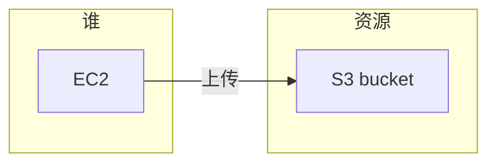
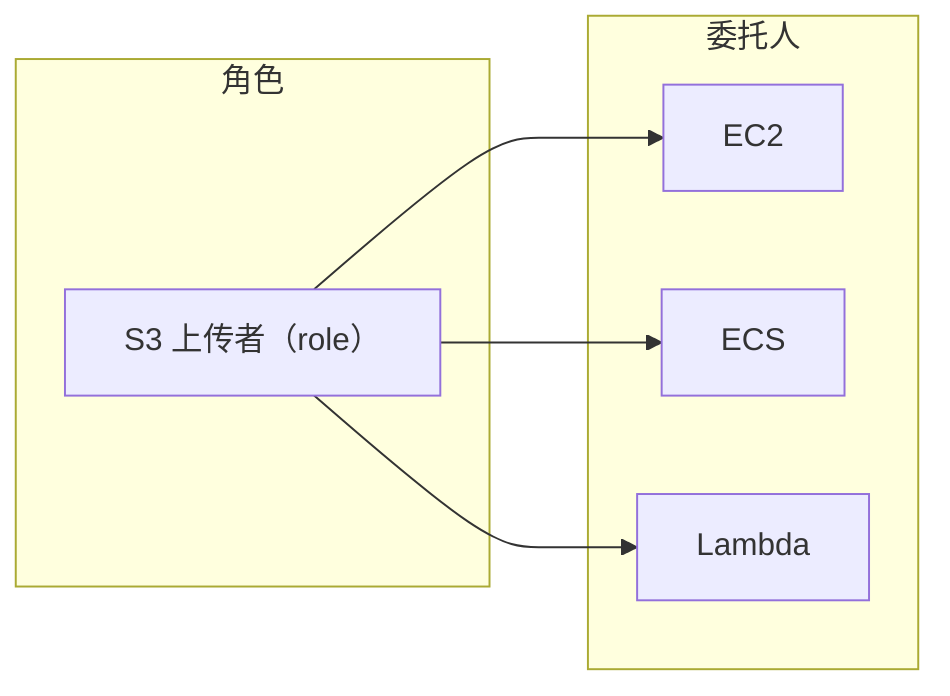
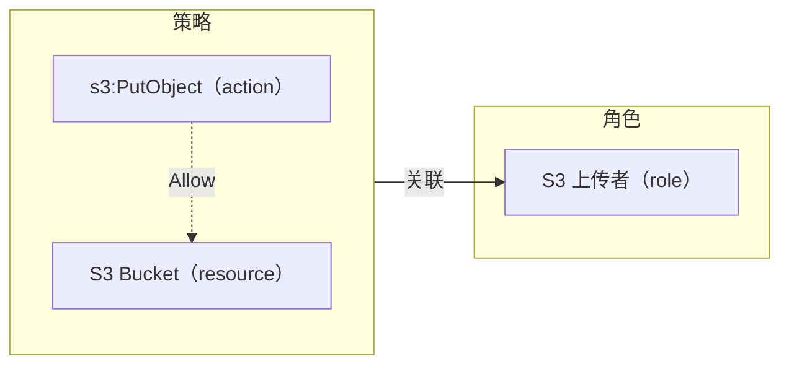
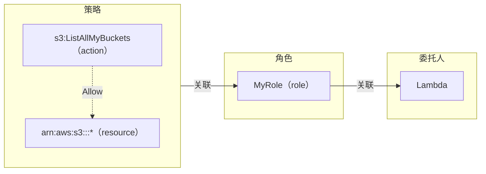

# 【AWS】IAM 系列（一）基于角色（role base）的权限控制

## 前言

[IAM](https://docs.aws.amazon.com/IAM/latest/UserGuide/introduction.html) 全称 Identity and Access Management，中文翻译为身份和控制管理，是 AWS 提供的一项免费的权限控制服务。IAM 是云服务安全性的基石，是开发者必须掌握的技能之一。试想如果所有资源都没有权限控制，任何人都可以随意修改和删除资源，这对于云端服务来说是一件多么危险的事情。

IAM 提供了多种权限控制方案，有基于用户的，也有基于角色的。这些方案都能实现权限控制的功能，因此初次接触 IAM 的开发者通常都会在方案选择上陷入迷茫。

基于角色的权限控制是使用最广泛，也是最推荐的权限控制方案。本文的目标是使开发者能够快速理解并上手基于角色的权限控制。

## 概念

IAM 的权限控制包含三个维度（以下简称为三要素），即：

1. **谁**能（或不能）对
2. 什么**资源**
3. **做什么**

例如：某 EC2 实例可以向某 S3 bucket 上传文件。这里的三要素分别是：

1. 谁：某 EC2 实例
2. 资源：某 S3 bucket
3. 做什么：上传文件



### 谁（role）

在基于角色（role base）的权限控制中，角色就是三要素中的“**谁**”。一个角色可以被关联到多个委托人，所有被关联的委托人都会成为 IAM 三要素中“**谁**”。



角色“**S3 上传者**”被关联到了三个委托人（EC2，ECS，Lambda）。关联后，这三个委托人就都可以被看作是“**S3 上传者**”这个角色。

如果读者对角色和委托人的关系还不是很清楚，可以用 Java 中的类和接口来做一下类比。角色就像一个接口（interface），委托人就是实现了这个接口的类（class），这些类都可以被视为该接口。

```java
interface SomeRole { }

class EC2 implements SomeRole { }
class ECS implements SomeRole { }
class Lambda implements SomeRole { }
```

### 资源（resource）

我们可以赋予上述角色一些资源的权限，这些资源可以是任意一个 AWS 资源。例如某个 S3 bucket，某个数据库，某个消息队列等。

### 做什么（action）

AWS 为每个资源都做了非常精细的权限控制。例如 S3 的权限包括：

- s3:CreateBucket
- s3:ListAllMyBuckets
- s3:GetBucketLocation
- s3:PutObject

这还只是冰山一角。到目前为止，S3 总共有上百个控制权限，详情可以看[这里](https://docs.aws.amazon.com/AmazonS3/latest/userguide/list_amazons3.html)。

### 策略（policy）

IAM 把上述三要素组织在一个 json 文件中，并且给这个 json 起了个名字，叫做**策略**。例如：

```json
{
    "Version": "2012-10-17",
    "Statement": [
        {
            "Effect": "Allow",
            "Action": [
                "s3:PutObject"
            ],
            "Resource": "arn:aws:s3:::awsexamplebucket1/*"
        }
    ]
}
```

- Version 是策略语言版本，最新版为 ```2012-10-17```。
- Statement 是一系列三元素的集合，也就是说一个策略可以配置多个三元素控制权限。
- Effect 的取值有 ```Allow``` 和 ```Deny```，分别表示允许或拒绝操作。示例中使用的是 Allow，表示允许 Action 中的操作。
- Action 就是对资源（resource）的操作，是个数组，因此可以定义对某一资源的多个操作。
- Resource 就是被控制的资源，示例中的是一个 S3 bucket。

### 策略与角色的关系

细心的读者会发现，资源（resource）和操作（action）已经体现在策略中了，但是似乎没有看到角色（role）的定义。其实角色和策略是两个独立的实体，通过将策略关联到角色来建立二者的联系。一个角色可以被关联**多个**策略。

如果把三元素和策略放在一起，他们会是如下的关系：



## 实战演练

掌握了 IAM 三要素和策略之后，让我们通过一个实战演练来展示一下基于角色的权限控制具体是如何使用的。

在实战演练中，我们会创建一个 [Lambda](https://docs.aws.amazon.com/lambda/latest/dg/welcome.html)，并通过角色赋予该 Lambda 读取所有 S3 bucket 的权限，如图所示：



### 创建 Lambda

我们依然基于 [CDK](https://docs.aws.amazon.com/cdk/v2/guide/home.html) 来创建所有资源。使用 CDK 的好处是你无需手动去 AWS Console 做资源的创建和配置，仅需通过代码就可实现全部操作。

#### 初始化 CDK 项目

创建并进入一个项目文件夹。

```bash
mkdir iam-role-lambda
cd iam-role-lambda
```

初始化 CDK 项目。

```bash
cdk init app --language typescript
```

#### 创建基于 Python 的 Lambda

用如下代码替换 ```./lib/iam-role-lambda-stack.ts``` 中的内容。

```typescript
import { Stack, StackProps } from 'aws-cdk-lib';
import { Construct } from 'constructs';
import * as lambda from 'aws-cdk-lib/aws-lambda';

export class IamRoleLambdaStack extends Stack {
  constructor(scope: Construct, id: string, props?: StackProps) {
    super(scope, id, props);

    new lambda.Function(this, 'MyFunction', {
      runtime: lambda.Runtime.PYTHON_3_9,
      handler: 'app.lambda_handler',
      code: lambda.Code.fromAsset('./my_function'),
    });
  }
}
```

#### 添加 Python 代码

创建 Python 代码文件。

```bash
mkdir my_function
cd my_function
touch app.py
```

将如下代码添加到 ```./my_function/app.py``` 文件中。这是一段 Lambda 执行的 Python 代码，作用是罗列出我的 AWS 帐号中的所有 S3 bucket。

```python
import boto3

def lambda_handler(event, context):
    # Retrieve the list of existing buckets
    s3 = boto3.client('s3')
    response = s3.list_buckets()

    # Output the bucket names
    print('Existing buckets:')
    for bucket in response['Buckets']:
        print(f'  {bucket["Name"]}')

    return "There are totally {} buckets.".format(len(response['Buckets']))
```

### 部署

现在就可以通过 CDK 将 Lambda 部署到云端了。

```bash
cdk deploy
```

你会看到类似如下输出：

```bash
✨  Synthesis time: 6.82s

This deployment will make potentially sensitive changes according to your current security approval level (--require-approval broadening).
Please confirm you intend to make the following modifications:

IAM Statement Changes
┌───┬───────────────────────────────┬────────┬────────────────┬──────────────────────────────┬───────────┐
│   │ Resource                      │ Effect │ Action         │ Principal                    │ Condition │
├───┼───────────────────────────────┼────────┼────────────────┼──────────────────────────────┼───────────┤
│ + │ ${MyFunction/ServiceRole.Arn} │ Allow  │ sts:AssumeRole │ Service:lambda.amazonaws.com │           │
└───┴───────────────────────────────┴────────┴────────────────┴──────────────────────────────┴───────────┘
IAM Policy Changes
┌───┬───────────────────────────┬────────────────────────────────────────────────────────────────────────────────┐
│   │ Resource                  │ Managed Policy ARN                                                             │
├───┼───────────────────────────┼────────────────────────────────────────────────────────────────────────────────┤
│ + │ ${MyFunction/ServiceRole} │ arn:${AWS::Partition}:iam::aws:policy/service-role/AWSLambdaBasicExecutionRole │
└───┴───────────────────────────┴────────────────────────────────────────────────────────────────────────────────┘
(NOTE: There may be security-related changes not in this list. See https://github.com/aws/aws-cdk/issues/1299)

Do you wish to deploy these changes (y/n)? y
IamRoleLambdaStack: deploying...
[0%] start: Publishing f8f0b6e3c0970c2b86947588bc5ab7fe4031c3bd8ea32db737f41a96be64a01c:current_account-current_region
[0%] start: Publishing a7505bba7bbf4039cb047dabb3f44c5254c20fae6434b5b2ddbff30e7dfbb009:current_account-current_region
[50%] success: Published f8f0b6e3c0970c2b86947588bc5ab7fe4031c3bd8ea32db737f41a96be64a01c:current_account-current_region
[100%] success: Published a7505bba7bbf4039cb047dabb3f44c5254c20fae6434b5b2ddbff30e7dfbb009:current_account-current_region
IamRoleLambdaStack: creating CloudFormation changeset...

 ✅  IamRoleLambdaStack

✨  Deployment time: 58.14s

Stack ARN:
arn:aws:cloudformation:us-east-1:376200971131:stack/IamRoleLambdaStack/63a27650-e479-11ec-9052-12b9e23c7aa5

✨  Total time: 64.96s
```

现在打开 AWS Console 网页，在 Lambda 页面的 Test 选项卡点击 Test 按钮执行该 Lambda。由于我们还没有给 Lambda 赋予读取 S3 bucket 的权限，因此 Lambda 会抛出一个异常。

```bash
START RequestId: 6fd00bc4-2630-4cf4-ad2e-4b261142f943 Version: $LATEST
[ERROR] ClientError: An error occurred (AccessDenied) when calling the ListBuckets operation: Access Denied
Traceback (most recent call last):
  File "/var/task/app.py", line 6, in lambda_handler
    response = s3.list_buckets()
  File "/var/runtime/botocore/client.py", line 391, in _api_call
    return self._make_api_call(operation_name, kwargs)
  File "/var/runtime/botocore/client.py", line 719, in _make_api_call
    raise error_class(parsed_response, operation_name)END RequestId: 6fd00bc4-2630-4cf4-ad2e-4b261142f943
REPORT RequestId: 6fd00bc4-2630-4cf4-ad2e-4b261142f943	Duration: 1738.98 ms	Billed Duration: 1739 ms	Memory Size: 128 MB	Max Memory Used: 71 MB	Init Duration: 260.31 ms
```

### 创建角色并配置权限

为了让 Lambda 能够读取 S3 bucket，我们需要创建一个角色，并为该角色配置允许访问 S3 bucket 的策略。编辑 ```./lib/iam-role-lambda-stack.ts``` 为如下内容：

```typescript
import { Stack, StackProps } from 'aws-cdk-lib';
import { Construct } from 'constructs';
import * as lambda from 'aws-cdk-lib/aws-lambda';
import * as iam from 'aws-cdk-lib/aws-iam';

export class IamRoleLambdaStack extends Stack {
  constructor(scope: Construct, id: string, props?: StackProps) {
    super(scope, id, props);

    const myRole = new iam.Role(this, 'MyRole', {
      assumedBy: new iam.ServicePrincipal('lambda.amazonaws.com'),
    });
    myRole.addToPolicy(new iam.PolicyStatement({
      effect: iam.Effect.ALLOW,
      resources: ['arn:aws:s3:::*'],
      actions: ['s3:ListAllMyBuckets'],
    }));

    new lambda.Function(this, 'MyFunction', {
      runtime: lambda.Runtime.PYTHON_3_9,
      handler: 'app.lambda_handler',
      code: lambda.Code.fromAsset('./my_function'),
      role: myRole,
    });
  }
}
```

在上边的代码中，我们创建了一个名为 ```myRole``` 的角色，并且为该角色添加了一个策略。该策略允许对所有 S3 资源执行 ```s3:ListAllMyBuckets``` 操作。最后将该角色关联至 Lambda，使该 Lambda 具有相应权限。

再次执行 ```cdk deploy``` 部署，然后以同样的方法再次执行该 Lambda。这次 Lambda 成功读取了我的所有 S3 bucket，并在结果中返回了 bucket 的数量。

```bash
There are totally 57 buckets.
```

我们的 Python 代码还在日志中记录了所有 S3 bucket 的名字。由于我的 bucket 数量过多，因此我只展示部分日志。

```bash
START RequestId: c3eb252b-246c-46c6-a715-ddc723c8d075 Version: $LATEST
Existing buckets:
cdk-hnb659fds-assets-376200971131-us-east-1
cdk-hnb659fds-assets-376200971131-us-west-2
...
END RequestId: c3eb252b-246c-46c6-a715-ddc723c8d075
REPORT RequestId: c3eb252b-246c-46c6-a715-ddc723c8d075	Duration: 1733.98 ms	Billed Duration: 1734 ms	Memory Size: 128 MB	Max Memory Used: 71 MB	Init Duration: 236.72 ms
```

## 总结

本文介绍了 IAM 三要素以及策略，并通过实战演练展示了如何使用基于角色的权限控制赋予 Lambda 相关权限。不仅是 Lambda，AWS 中绝大多数的服务都可以通过角色配置权限，例如 ECS，Redshift 等。读者可关注各个服务中的角色选项自行配置。
