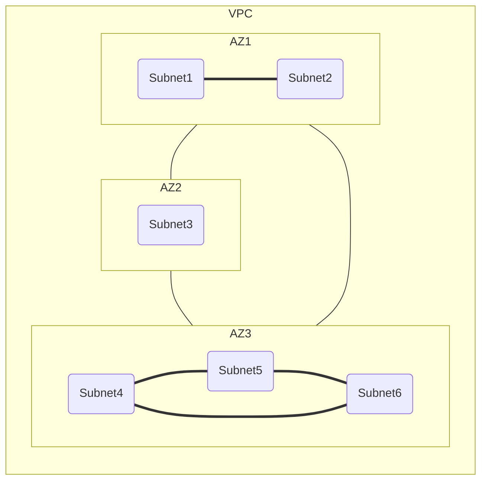
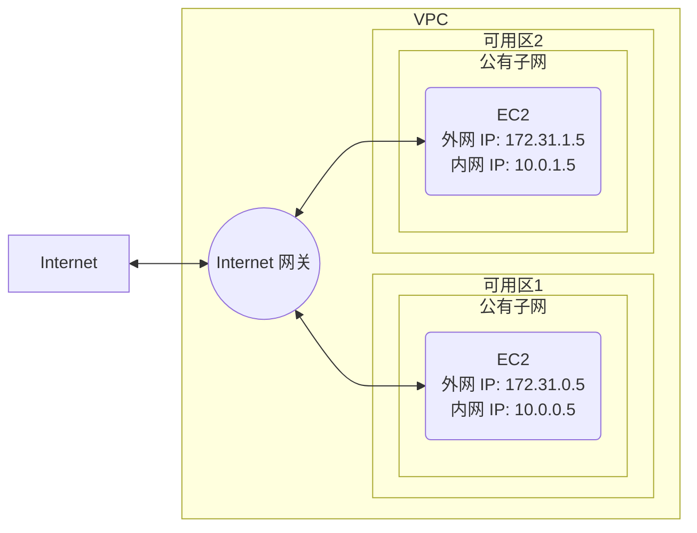
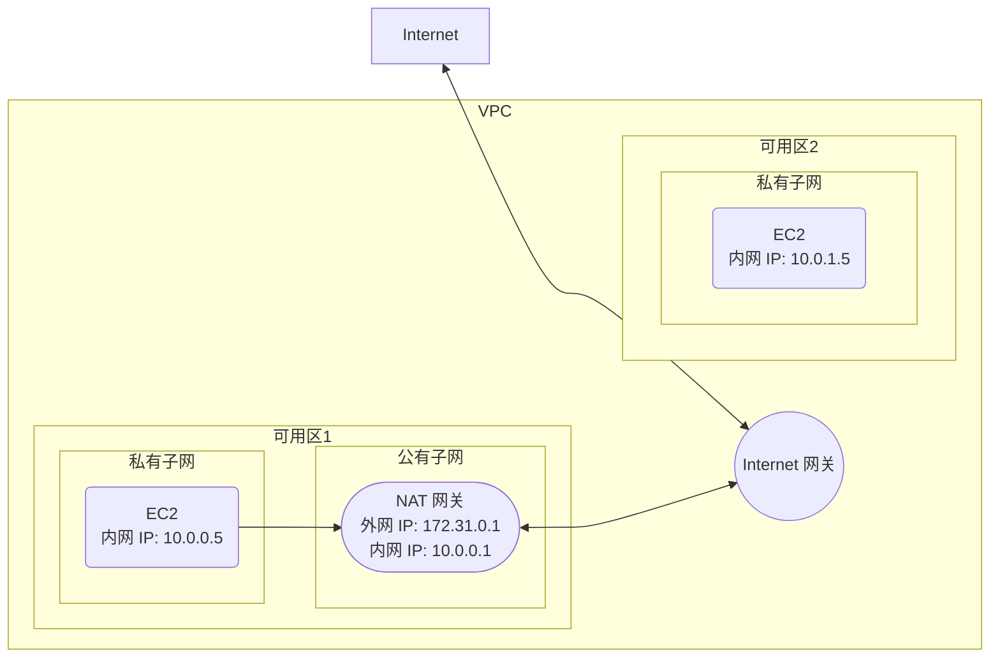
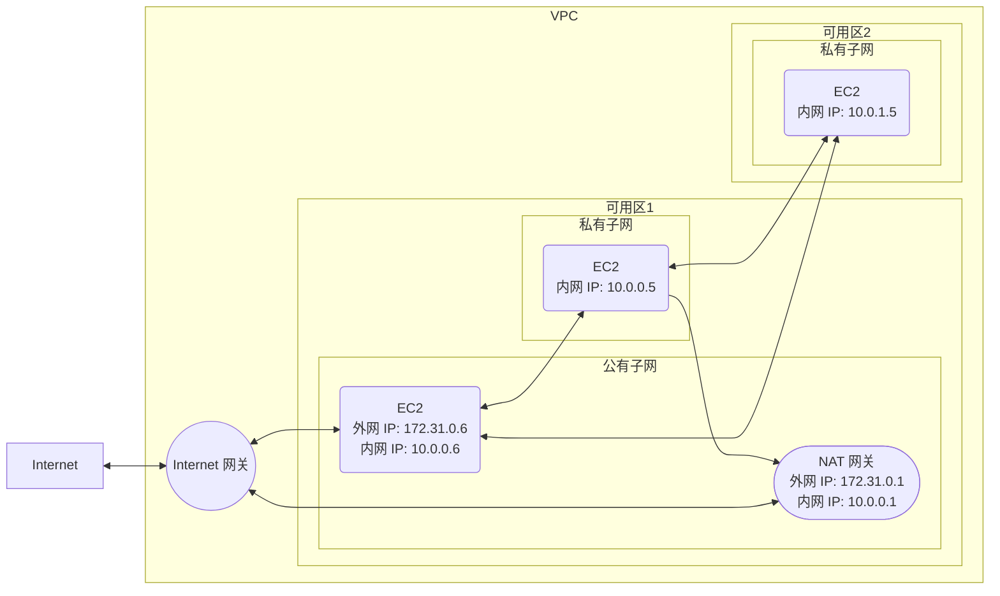

# 【AWS】VPC 系列（一）一文搞懂「可用区」「子网」「Internet 网关」「NAT 网关」

## 前言

VPC 是 AWS 中最基础也是应用最广泛的一个服务。然而大多数人对 VPC 却不甚了解，以至于经常遇到一些奇怪的网络问题。  
计算机网络是一门既复杂又晦涩难懂的学科，就连 VPC 的官方文档也是写得云里雾里，这让很多没有网络背景的人根本无从下手。  

本系列文章旨在从应用的角度出发，介绍 VPC 的基本概念，让没有网络背景的人也可以轻松玩转 VPC。  
本篇会介绍 VPC 最基础的三个概念：子网、Internet 网关和 NAT 网关。尤其是子网，在创建很多资源（如数据库）的时候都要指定。看完本篇，你会对子网有一个全面的认识，以后配置子网的时候再也不犯难。  

## VPC

首先需要了解 VPC、可用区（AZ）和子网（Subnet）的关系。  

> 通过 Amazon Virtual Private Cloud (Amazon VPC)，您可以将 AWS 资源启动到您定义的虚拟网络中。这个虚拟网络与您在数据中心中运行的传统网络极其相似，并会为您提供使用的可扩展基础设施的优势AWS。

-*摘自 AWS 官方文档*

换句话说，VPC 是 AWS 为你开辟的一块专属空间，这个 VPC 就是你的地盘，其他人无法入侵。  

## 可用区（Available Zone、AZ）

> 一个可用区 (AZ) 是指一个 AWS 区域中的一个或多个离散的数据中心，具有冗余电源、联网和连接。可用区让客户能够运行在可用性、容错能力和可扩展性方面比单个数据中心更强的生产应用程序和数据库。一个 AWS 区域中的所有可用区都通过高带宽、低延迟网络与完全冗余的专用城域光纤互连，为可用区之间提供高吞吐量和低延迟的联网。可用区之间的所有流量都进行了加密。网络性能足以确保可用区之间的同步复制。可用区使分区应用程序更容易获得高可用性。如果应用程序在可用区之间进行分区，则可以更好地隔离公司并防止断电、雷击、龙卷风、地震等问题的影响。可用区与任何其他可用区都间隔一定距离，不过彼此都在 100 公里（60 英里）以内。  

-*摘自 AWS 官方文档*

可用区的作用是增强可用性。如果一个可用区出现了故障（例如断网、断电），其他可用区可以继续提供服务，用户完全无感知。  
可用区之间的网络延迟极低，就像大学校园里的局域网一样。因此不同的可用区就像在同一个大的局域网中，可以通过**内网 IP** 直接访问。

## 子网（Subnet）

> 子网是您的 VPC 内的 IP 地址范围。您可以将AWS资源（例如 EC2 实例）在特定子网中启动。在创建子网时，指定子网的 IPv4 CIDR 块，它是 VPC CIDR 块的子集。每个子网都必须完全位于一个可用区之内，**不能跨越多个可用区**。通过在独立的可用区内启动实例，您可以保护您的应用程序不受单一可用区故障的影响。

-*摘自 AWS 官方文档*

简单来说，子网就是在可用区内基于 IP 地址再划分出专属区域。每个子网的 IP 地址段**互不重叠**。  

下图展示了 VPC、可用区和子网的关系。该 VPC 总共包含三个可用区，每个可用区划分出了若干个子网。  

### 子网类型

子网存在的意义是什么？为什么要在可用区里创建子网？要回答这个问题，先看一下有哪几种子网类型。  
总共有三种类型的子网：

- 公有子网
- 带有 NAT 网关的私有子网
- 被隔离的私有子网

有的子网可以访问外网，有的则不能；有的子网可以被外网访问，而有的则不能。听着有些拗口，想绕口令一样，下面具体看看这 3 种子网都有什么特性。

#### 公有子网

公有子网具有**最大**的连通性，既可以访问 Internet 外网也可以被外网访问。公有子网中的资源最大的特点是有两个 IP 地址：**外网 IP** 和**内网 IP**。  
Internet 网关作为桥梁，连接了 Internet 和公有子网。

需要注意的是，每个 VPC 只有**一个** Internet 网关，而且 Internet 网关只是 VPC 和 Internet 之间的一个**逻辑连接**，不是一个物理设备。因此 Internet 网关的带宽并不由 Internet 网关本身决定，而是由 EC2 的带宽决定。

如果没有 Internet 网关， Internet 将无法连接到 VPC 中的资源。  
最后再总结一下 Internet 网关的作用：让公有子网内的资源连接 Internet，同时也让 Internet 连接公有子网内的资源。

#### 带有 NAT 网关的私有子网

NAT 网关介于私有子网和 Internet 网关之间，能够将私有子网内的多个**私有 IP** 映射到一个**公有 IP**，从而让私有子网内的资源可以访问 Internet。  

下面展示一个 NAT 网关的使用案例。

NAT 网关是和 EC2 平级的位于公有子网内的计算资源，负责**私有 IP** 和**公有 IP** 的转换及流量转发。  
可用区 1 中的 EC2 通过 NAT 网关访问 Internet。而可用区 2 没有 NAT 网关，因此该可用区内的 EC2 **无法**访问 Internet。

NAT 网关和 Internet 网关有以下几个区别：

1. NAT 网关负责让**私有**子网访问 Internet；Internet 网关负责让**公有**子网访问 Internet。
2. NAT 网关的连接是**单向**的，私有子网可以访问 Internet，但是 Internet **无法**访问私有子网（除非显示地允许该访问，但不在本文的讨论范围之内）； Internet 网关的连接是**双向**的。
3. NAT 网关工作在**可用区**，Internet 网关工作在 **VPC**。
4. NAT 网关运行于具体的**物理设备**，带宽从 5Gbps 到 45Gbps 之间伸缩，因此使用 NAT 网关会产生额外费用；Internet 网关只是个**逻辑连接**，没有带宽限制，也不会产生费用。

#### 隔离的私有子网

隔离的私有子网就是**没有** NAT 网关的私有子网，上图可用区 2 中的私有子网就是一个隔离的私有子网。  
隔离的私有子网无法访问或被 Internet 访问，只能和 VPC 内的资源相互连接。  

下图是融合了公有子网、带有 NAT 的私有子网以及隔离的私有子网的使用案例。

上图的连通性涉及到 5 方，分别是：

1. 公有子网**外网 IP**
2. 公有子网**内网 IP**
3. 带有 NAT 网关的私有子网**内网 IP**
4. 隔离的私有子网**内网 IP**
5. Internet

下边的表格总结了这 5 方的连通性，（**Y** 表示可联通，**N** 表示不可联通）。  
该表格的**行**为连接的发起方，**列**为连接的接收方。例如 Internet 发起向公有子网外网 IP 的连接，对应表格的最后一行第一列，该格的值是 **Y**，表示可连通。

| 通信方 | 公有子网外网 IP | 公有子网内网 IP | 带有 NAT 网关的私有子网内网 IP | 隔离的私有子网内网 IP | Internet |
|:-|:-:|:-:|:-:|:-:|:-:|
| 公有子网 | Y | Y | Y | Y | Y |
| 带有 NAT 网关的私有子网 | Y | Y | Y | Y | Y |
| 隔离的私有子网 | N | Y | Y | Y | N |
| Internet | Y | N | N | N | Y |

## 总结

以上就是关于子网、Internet 网关和 NAT 网关的基本介绍，希望这篇文章能帮助你了解 VPC 最基础的概念。更详尽的介绍请参阅 AWS 的官方[文档](https://docs.aws.amazon.com/zh_cn/vpc/latest/userguide/build-create-vpc-and-subnets.html)。
