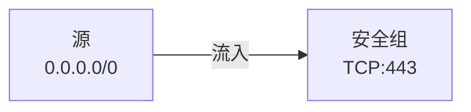
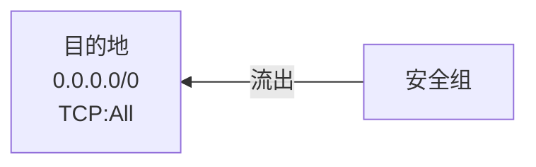

# 【AWS】VPC 系列（二）安全组和网络 ACL 应该怎么选？

## 前言

 VPC 提供了[安全组](https://docs.aws.amazon.com/zh_cn/vpc/latest/userguide/VPC_SecurityGroups.html)和[网络 ACL](https://docs.aws.amazon.com/zh_cn/vpc/latest/userguide/vpc-network-acls.html)来控制流量的流动。二者具有相似的功能，于是很多人都会有一个疑问，我究竟应该使用安全组还是应该使用网络 ACL？本文会介绍这二者的异同，帮助你做出合理的选型。  

## 安全组

> 安全组充当虚拟防火墙，控制允许到达和离开与其关联的资源的流量。例如，在将安全组与 EC2 实例关联后，它将控制该实例的入站和出站流量。

-*摘自 AWS 官方文档*

用过 Windows 的小伙伴可能都知道防火墙，它允许你控制哪些流量可以流入计算机，以及哪些流量可以流出。安全组就是这样一个防火墙，它可以被关联到 VPC 内的实例（如 EC2）。关联后，这台 EC2 就有了类似 Windows 中那样的防火墙。所以我们可以粗暴地认为**安全组**就是实例的**防火墙**。  

对于每个安全组，你都可以添加若干入站规则和出站规则。  

### 入站规则

入站规则描述了什么样的流量可以流入实例，例如下方的入站规则允许任意一个 IP 地址通过 HTTPS 协议访问实例。  

| 源 IP | 协议类型 | 端口号 | 描述 |
|--|--|--|--|
| 0.0.0.0/0 | TCP | 443 | 允许从所有 IPv4 地址进行入站 HTTPS 访问 |

源 **0.0.0.0/0** 表示任意一个 IP 地址，即允许来自**所有** IP 地址的流量进入。HTTPS 运行在 TCP 协议的 443 端口之上，据此设置协议类型和端口号。下图表示了该入站规则。  



### 出站规则

出站规则描述了什么样的流量可以流出实例，例如下方的出站规则允许实例将流量发送到任何地方。

| 目的地 IP | 协议类型 | 端口号 | 描述 |
|--|--|--|--|
| 0.0.0.0/0 | TCP | All | 允许所有的出站 IPv4 流量 |

和入站规则一样，**0.0.0.0/0** 表示任意一个 IP 地址，即允许流量流出到任何地方。由于客户端通常会使用一个随机的端口接收服务器的响应，因此该出站规则的端口范围是 All，这样才能覆盖客户端所有的随机端口。下图表示了该出站规则。  



需要注意的是，**源**和**目的地**不仅可以是 IP 地址，也可以是另一个**安全组**。

### 连接跟踪

> 安全组使用**连接跟踪**来跟踪有关进出实例的流量的信息。安全组将基于流量的连接状态应用规则以确定允许还是拒绝流量。有了这种方法，安全组就具有状态。这意味着无论出站安全组规则如何都允许对入站流量的响应流出实例，反之亦然。  

-*摘自 AWS 官方文档*

官方文档对连接跟踪的描述比较晦涩难懂，简单来说连接跟踪有助于简化**请求响应**模式的出入站规则配置。请求响应模式常见于网络传输协议（如 HTTP），客户端向服务器发起一个请求，服务器将响应返回给客户端，**请求**和**响应**总是成对出现。借助安全组的连接跟踪特性，我们可以实现如下两个效果。

1. 如果从源发来的**请求**流量通过了入站规则进入实例，则随后的**响应**流量在出站时会**忽略**出站规则直接流出。

    ```mermaid
    flowchart LR
        SOURCE[源]
        SG[安全组]
        SOURCE --->|1. 允许入站| SG
        SG --->|2. 忽略出站规则| SOURCE
    ```

2. 如果从实例发出的**请求**流量通过了出站规则流出实例，则随后的**响应**流量在入站时会**忽略**入站规则直接流入。

    ```mermaid
    flowchart RL
        SG[安全组]
        SOURCE[目的地]
        SG --->|1. 允许出站| SOURCE
        SOURCE --->|2. 忽略入站规则| SG
    ```

#### 未跟踪的连接

并不是所有的连接都会被跟踪（有状态）。如果有一个安全组规则允许所有通信（0.0.0.0/0 或 ::/0）的 TCP 或 UDP 流，而另一个方向上存在一个对应的规则允许所有端口（0-65535）的所有响应通信（0.0.0.0/0 或 ::/0），则不会跟踪该通信流。下边的例子展示了其中的一些规律。  

##### 入站规则

| 源 IP | 协议类型 | 端口号 |
|--|--|--|
| 203.0.113.1/32 | TCP | 22（SSH）|
| 0.0.0.0/0 | TCP | 80（HTTP）|
| ::/0 | TCP | 80（HTTP）|
| 0.0.0.0/0 | ICMP | All |

##### 出站规则

| 目的地 IP | 协议类型 | 端口号 |
|--|--|--|
| 0.0.0.0/0 | All | All |
| ::/0 | All | All |

- 将会跟踪端口 22（SSH）上流入和流出实例的 TCP 流量，因为入站规则只允许来自 203.0.113.1/32 的流量，而不是所有 IP 地址（0.0.0.0/0）。
- **不会**跟踪端口 80（HTTP）上流入和流出实例的 TCP 流量，因为入站和出站规则都允许所有流量（0.0.0.0/0 或 ::/0）。
- 无论规则如何，始终跟踪 ICMP 流量，因为不是 TCP 或 UDP 协议。
- 如果您从安全组删除出站规则，则将跟踪往返于实例上的所有流量，包括端口 80（HTTP）上的流量，因为出站规则不再允许所有 IP 地址。

## 网络 ACL

> 网络访问控制列表（ACL）是 VPC 的一个可选安全层，可用作防火墙来控制进出一个或多个子网的流量。你可以设置网络 ACL，使其规则与你的安全组相似，以便为你的 VPC 添加额外安全层。

-*摘自 AWS 官方文档*

网络 ACL 和安全组极为相似，都可作为防火墙控制流量的进出，且工作在子网级别。因此我们可以粗暴地认为**网络 ACL** 是**子网**的**防火墙**。下文会先介绍网络 ACL 特有的功能，随后对比网络 ACL 和安全组之间的不同之处。

### 可设置拒绝规则

安全组使用白名单模式设置规则，每条规则都表示**允许**某种流量通过。而网络 ACL 还支持黑名单模式，可以设置**拒绝**哪些流量通过。例如下边的**入站**规则：

| 规则编号 | 源 IP | 类型 | 协议类型 | 端口号 | 允许/拒绝 | 注释 |
|--|--|--|--|--|--|--|
| 120 | 0.0.0.0/0 | SSH | TCP | 22 | 拒绝 | 拒绝所有 SSH 连接 |
| * | 0.0.0.0/0 | All traffic | All | All | 允许 | 允许所有连接 |

该入站规则表示拒绝所有 SSH 流量的流入，但是允许其余所有流量。由于同时存在**允许**和**拒绝**两种规则，因此允许和拒绝规则间可能会存在冲突。例如某流量在**规则 1** 中被允许，但在**规则 2** 中被拒绝。

为了解决这种冲突，网络 ACL 按照规则编号由小到大逐个尝试。如果流量遇到了适用的规则，则应用该规则，并停止尝试后续规则。

## 安全组与网络 ACL 的差异

如上文所述，网络 ACL 只比安全组多了黑名单模式，即**拒绝**规则。本节会介绍安全组和网络 ACL 之间的差异。

| 安全组 | 网络 ACL |
|--|--|
| 在实例级别运行 | 在子网级别运行 |
| 仅支持允许规则 | 支持允许规则和拒绝规则 |
| 有状态：返回数据流会被自动允许，不受任何规则的影响 | 无状态：返回数据流必须被规则明确允许 |
| 会在决定是否允许数据流前评估所有规则 | 在决定是否允许流量时，按顺序处理规则，从编号最低的规则开始 |
| 只有在启动实例的同时指定安全组、或稍后将安全组与实例关联的情况下，操作才会被应用到实例 | 自动应用于与之关联的子网中的所有实例（因此，如果安全组规则过于宽松，它提供额外的防御层）|

二者最主要的差别是安全组作用于实例（如 EC2），因此每个实例都可以配置不同的安全组。而网络 ACL 作用于子网，相当于是给子网装了一个防火墙，子网内的所有资源都会被网络 ACL 保护。

## 最佳实践

由于安全组和网络 ACL 都能提供流量控制功能，理论上只用二者之一就可以保护 VPC 的安全。但是最佳实践还是二者结合使用，为 VPC 提供更全面的防护。

- 同时使用安全组和网络 ACL 相当于加了双重保险，如果你不小心误设了其中之一，另外一层保护依然能确保 VPC 的安全。
- 安全组作用于实例，因此安全组适合针对不同实例的精细化配置；网络 ACL 作用于子网，适合针对子网内所有实例的通用配置。
- 如果组织内有专门管理网络的团队，则该团队适合使用网络 ACL；研发或运维团队则负责实例级的安全组配置。

## 总结

本文介绍了 VPC 提供的两种虚拟防火墙——安全组和网络 ACL，对比了二者的差异，并提供了一些最佳实践的建议。更多的信息可以参阅 AWS 的官方文档，如果有任何疑问也欢迎在评论区互动。
