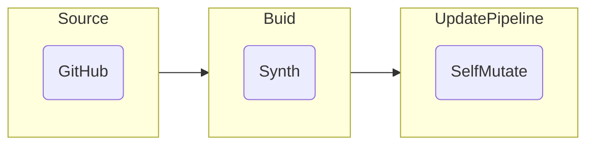
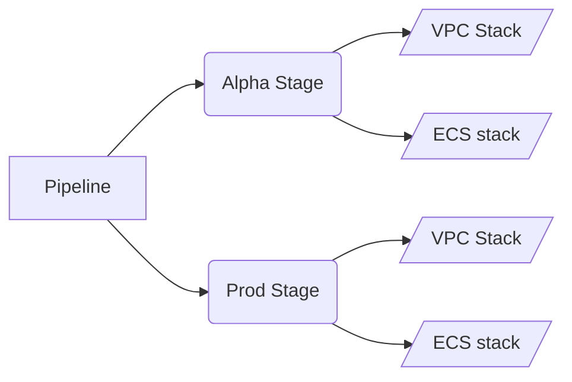
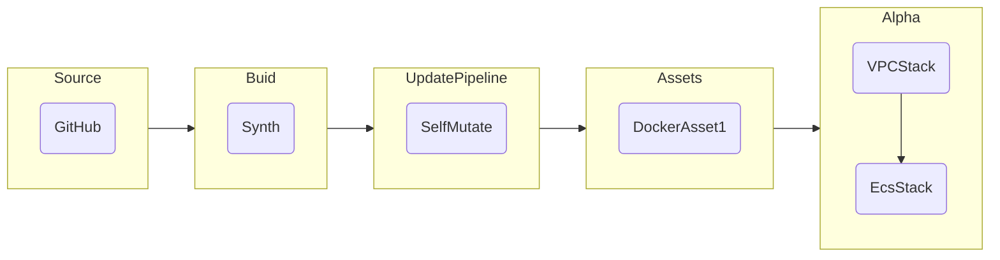
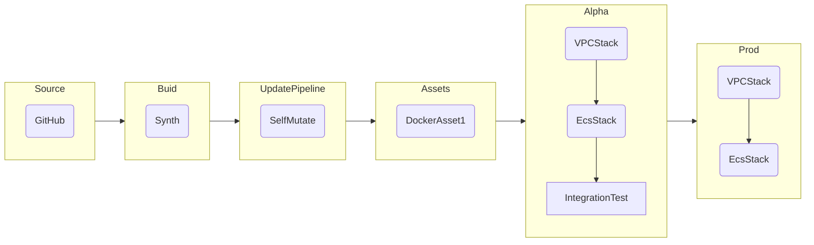

# 【AWS】使用 CDK 轻松构建容器化的 CI/CD 系统

## 概念

本文涉及到 **CI/CD**，**Infrastructure as code** 和 **Docker**。你不需要精通这些技术，下文会对这些概念进行简单讲解。

### CI/CD 是什么

> 在[软件工程](https://zh.wikipedia.org/wiki/%E8%BD%AF%E4%BB%B6%E5%B7%A5%E7%A8%8B "软件工程")中，**CI/CD** 或 **CICD** 通常指的是[持续集成](https://zh.wikipedia.org/wiki/%E6%8C%81%E7%BB%AD%E9%9B%86%E6%88%90 "持续集成")和[持续交付](https://zh.wikipedia.org/wiki/%E6%8C%81%E7%BA%8C%E4%BA%A4%E4%BB%98 "持續交付")或[持续部署](https://zh.wikipedia.org/wiki/%E6%8C%81%E7%BA%8C%E9%83%A8%E7%BD%B2 "持續部署")的组合实践[[1]](https://zh.wikipedia.org/wiki/CI/CD#cite_note-1)[[2]](https://zh.wikipedia.org/wiki/CI/CD#cite_note-2)[[3]](https://zh.wikipedia.org/wiki/CI/CD#cite_note-Atlassian_2017-3)。CI/CD 通过在应用程序的构建、测试和部署中实施自动化，在开发和运营团队之间架起了桥梁。  
> 现代 [DevOps](https://zh.wikipedia.org/wiki/DevOps "DevOps") 实践涉及软件应用程序在整个开发生命周期内的持续开发、持续测试、持续集成、持续部署和持续监控。**CI/CD** 实践或 **CI/CD管道**（CI/CD pipeline）构成了现代DevOps业务的主干。

*- 摘自 [wikipedia](https://zh.wikipedia.org/wiki/CI/CD)*

通俗来讲就是把下边这些步骤自动化。  

- 代码提交
- 构建打包
- 部署
- 测试
- 回滚（如果发生故障）

有了 CI/CD 系统之后，开发人员只需提交代码，后续的部署及测试工作全部由系统自动完成。整个流程甚至可做到无人值守，换句话说 DevOps 团队可以直接被 CI/CD 系统所取代。  

（*亚马逊内部已经几乎没有 DevOps 岗了）*

### CDK 是什么

基础设施即代码（Infrastructure as code）指的是通过代码而不是手动流程来管理和配置基础设施。IaC 有时也被称为“可编程基础设施”，可将基础设施配置完全当作软件编程来进行。  
使用 IaC 之后，开发人员可以一键创建出多个环境，例如开发环境，测试环境和生产环境，不同环境的基础设施完全一致。  

[AWS Cloud Development Kit](https://docs.aws.amazon.com/cdk/v2/guide/home.html)（**CDK**）是由 AWS 推出 的 IaC 套件，该套件可以通过代码的方式创建云服务的资源。  
CDK 支持 TypeScript，JavaScript，Python，Java，C#/.Net 和（in developer preview）Go，这也意味着在面向对象程序设计里的所有技巧均可直接应用到资源的创建和配置上。  

一个典型的例子是创建基于容器的 WEB 服务。如果手动在 AWS Console 上创建一个基于 Docker 的服务，需要创建以下资源。  

- VPC
- LoadBalancer
- Target Group
- Elastic Container Service
  - Repository
  - Cluster
  - Task
  - Service
- IAM role

创建好以上资源后还需要做非常复杂的配置才能让这些资源正常工作。对于初次接触这些基础设施的人来说，仅仅是搭建一个示例工程就会耗费大量的时间和精力。如果还需要创建开发环境和测试环境，工作量之大可想而知。  

CDK 提供了很高级的封装，以上所有的工作在 CDK 中被简化为了三个对象的创建。  

```typescript
const vpc = new ec2.Vpc(this, "MyVpc");

const cluster = new ecs.Cluster(this, "MyCluster", {
  vpc: vpc
});

// Create a load-balanced Fargate service and make it public
new ecs_patterns.ApplicationLoadBalancedFargateService(this, "MyFargateService", {
  cluster: cluster, // Required
  cpu: 512, // Default is 256
  desiredCount: 6, // Default is 1
  taskImageOptions: { image: ecs.ContainerImage.fromRegistry("amazon/amazon-ecs-sample") },
  memoryLimitMiB: 2048, // Default is 512
  publicLoadBalancer: true // Default is false
});
```

如此一来，数小时的工作被缩减到几分钟。足以见得 CDK 对生产力和生产质量的巨大提升。

## 本文目标

本文的目标是使用 CDK 在 AWS 上搭建云原生的 CI/CD 系统，并通过该系统部署一个基于 Docker 的网站。

## 创建项目

创建一个 GitHub 仓库，用两个文件夹来分别存放 CDK 和网站的代码。目录结构如下。

```bash
.
├── cdk
└── service
```

不推荐用两个 GitHub 仓库来分别存放 CDK 和网站的代码。因为在开发的过程中，经常要同时提交 CDK 和网站的代码。而两个 GitHub 仓库无法保证原子提交，这可能会导致后续部署的时候新旧代码混用，产生不可预知的错误。这也是 Google 内部没有使用 Git，而是使用了一个统一代码库的原因之一。

### Web

本文聚焦于使用 CDK 构建 CI/CD 系统并部署 Docker 镜像，镜像的具体内容并不是本文的重点。所以使用 Python 自带的极简 HTTP server 作为示例网站，这个网站简单到只包含一个 Dockerfile。  

```Dockerfile
# ./service/Dockerfile

FROM python:3

EXPOSE 8080
CMD python -m http.server 8080
```

进入 **service** 目录，可以通过 [Docker Desktop](https://www.docker.com/products/docker-desktop/) 在本地测试该网站。  

```bash
docker build -t simple-http .
docker run -p 8080:8080 simple-http
```

随后在浏览器中打开 <http://localhost:8080>，该网站会列出服务器上的文件。现在目录结构变为：  

```bash
.
├── cdk
└── service
    └── Dockerfile
```

### CDK

CDK 代码是本文的核心，CI/CD 系统以及 WEB 服务用到的资源均由 CDK 创建。以下步骤均在 **cdk** 目录下完成。

#### 安装

使用 [npm](https://www.npmjs.com/) 可以轻松安装 CDK CLI。  

```bash
npm install -g aws-cdk-lib
```

安装完成后执行 ```cdk --version``` 来验证安装，能看到类似如下输出。  

```bash
2.18.0 (build 75c90fa)
```

#### Bootstrap

CDK 需要少量的 AWS 资源（例如 S3，ECR）才能运行，创建这些资源的步骤被称作 bootstrap。执行以下命令以进行 bootstrap。  

```bash
export CDK_NEW_BOOTSTRAP=1
cdk bootstrap \
    --cloudformation-execution-policies arn:aws:iam::aws:policy/AdministratorAccess \
    aws://YOUR_ACCOUNT_ID/YOUR_REGION
```

执行 bootstrap 命令后能看到类似如下输出。

```bash
  ⏳  Bootstrapping environment aws://YOUR_ACCOUNT_ID/YOUR_REGION...
Trusted accounts for deployment: (none)
Trusted accounts for lookup: (none)
Execution policies: arn:aws:iam::aws:policy/AdministratorAccess
CDKToolkit: creating CloudFormation changeset...

 ✅  Environment aws://YOUR_ACCOUNT_ID/YOUR_REGION bootstrapped.
```

#### 初始化 CDK 项目

现在就可以正式开始编写 CDK 代码了。如上文所提到的，CDK 支持多种编程语言，本文使用最流行的 TypeScript。进入到 CDK 目录后，执行以下命令初始化 CDK 项目。  

```bash
cdk init app --language typescript
```

会看到类似如下输出。  

```bash
Applying project template app for typescript
# Welcome to your CDK TypeScript project

This is a blank project for TypeScript development with CDK.

The `cdk.json` file tells the CDK Toolkit how to execute your app.

## Useful commands

* `npm run build`   compile typescript to js
* `npm run watch`   watch for changes and compile
* `npm run test`    perform the jest unit tests
* `cdk deploy`      deploy this stack to your default AWS account/region
* `cdk diff`        compare deployed stack with current state
* `cdk synth`       emits the synthesized CloudFormation template

Executing npm install...
npm WARN deprecated source-map-url@0.4.1: See https://github.com/lydell/source-map-url#deprecated
npm WARN deprecated urix@0.1.0: Please see https://github.com/lydell/urix#deprecated
npm WARN deprecated resolve-url@0.2.1: https://github.com/lydell/resolve-url#deprecated
npm WARN deprecated source-map-resolve@0.5.3: See https://github.com/lydell/source-map-resolve#deprecated
npm WARN deprecated sane@4.1.0: some dependency vulnerabilities fixed, support for node < 10 dropped, and newer ECMAScript syntax/features added
✅ All done!
```

为提升可读性，这里将自动生成的 ```cdk-stack.ts``` 和 ```cdk.test.ts``` 文件重命名为 ```pipeline-stack.ts``` 和 ```pipeline.test.ts```。  
在 ```cdk.json``` 的 **context** 中添加 ```"@aws-cdk/core:newStyleStackSynthesis": true```。修改后的 ```./cdk/cdk.json``` 文件内容如下。

```json
{
  "app": "npx ts-node --prefer-ts-exts bin/cdk.ts",
  "watch": {
    "include": [
      "**"
    ],
    "exclude": [
      "README.md",
      "cdk*.json",
      "**/*.d.ts",
      "**/*.js",
      "tsconfig.json",
      "package*.json",
      "yarn.lock",
      "node_modules",
      "test"
    ]
  },
  "context": {
    "@aws-cdk/aws-apigateway:usagePlanKeyOrderInsensitiveId": true,
    "@aws-cdk/core:stackRelativeExports": true,
    "@aws-cdk/aws-rds:lowercaseDbIdentifier": true,
    "@aws-cdk/aws-lambda:recognizeVersionProps": true,
    "@aws-cdk/aws-cloudfront:defaultSecurityPolicyTLSv1.2_2021": true,
    "@aws-cdk-containers/ecs-service-extensions:enableDefaultLogDriver": true,
    "@aws-cdk/aws-ec2:uniqueImdsv2TemplateName": true,
    "@aws-cdk/core:target-partitions": [
      "aws",
      "aws-cn"
    ],
    "@aws-cdk/core:newStyleStackSynthesis": true
  }
}
```

此时的目录结构为：  

```bash
.
├── README.md
├── cdk
│   ├── README.md
│   ├── bin
│   │   └── cdk.ts
│   ├── cdk.json
│   ├── jest.config.js
│   ├── lib
│   │   ├── pipeline-stack.ts
│   ├── package-lock.json
│   ├── package.json
│   ├── test
│   │   └── pipeline.test.ts
│   └── tsconfig.json
└── service
    └── Dockerfile
```

#### 授权 GitHub

需要在 AWS 中创建一个 GitHub connection，以便让 CI/CD 系统能够从 GitHub 获取代码。创建的方法很简单，跟着 [文档](https://docs.aws.amazon.com/dtconsole/latest/userguide/connections-create-github.html) 点几下鼠标就可以了。  
Connection 创建后会得到一个 ARN，这个会在下一步中用到。

#### 创建空 pipeline

AWS 有一套托管的 CI/CD 服务，包括 [CodeBuild](https://docs.aws.amazon.com/codebuild/?id=docs_gateway) 和 [CodePipeline](https://docs.aws.amazon.com/codepipeline/?id=docs_gateway) 等几个服务。  
先在 CDK 中创建一个空的 pipeline。注意这里的 connectionArn 来自于在上一步中创建的 GitHub connection。  

```typescript
// ./cdk/lib/pipeline-stack.ts

import { Stack, StackProps } from 'aws-cdk-lib';
import { Construct } from 'constructs';
import { CodePipeline, CodePipelineSource, ShellStep } from 'aws-cdk-lib/pipelines';

export class PipelineStack extends Stack {
  constructor(scope: Construct, id: string, props?: StackProps) {
    super(scope, id, props);

    const pipeline = new CodePipeline(this, 'SimpleHttpServicePipeline', {
      pipelineName: 'SimpleHttpServicePipeline',
      synth: new ShellStep('Synth', {
        input: CodePipelineSource.connection('best-cloud/cdk-pipeline-ecs', 'main', {
          connectionArn: 'arn:aws:codestar-connections:YOUR_REGION:YOUR_ACCOUNT_ID:connection/CONNECTION_ID',
        }),
        commands: ['cd cdk', 'npm ci', 'npm run build', 'npx cdk synth'],
        primaryOutputDirectory: 'cdk/cdk.out',
      }),
    });
  }
}
```

然后再对 ```bin/pipeline.ts``` 做一些改动。  

```typescript
// ./cdk/bin/pipeline.ts

#!/usr/bin/env node
import 'source-map-support/register';
import * as cdk from 'aws-cdk-lib';
import { PipelineStack } from '../lib/pipeline-stack';

const app = new cdk.App();
new PipelineStack(app, 'PipelineStack', {
  env: { account: 'YOUR_ACCOUNT_ID', region: 'YOUR_REGION' },
  /* For more information, see https://docs.aws.amazon.com/cdk/latest/guide/environments.html */
});

app.synth();
```

现在就可以把代码 Push 到 GitHub 仓库了。  

```bash
git add --all
git commit -m "initial commit"
git push
```

然后在 CDK 目录下执行 ```cdk deploy``` 来做初次部署，会看到类似如下的输出。  

```bash
✨  Synthesis time: 6.82s

This deployment will make potentially sensitive changes according to your current security approval level (--require-approval broadening).
Please confirm you intend to make the following modifications:

IAM Statement Changes
┌───┬──────────────────────────────────────────────────────────────────────────┬────────┬──────────────────────────────────────────────────────────────────────────┬──────────────────────────────────────────────────────────────────────────┬───────────────────────────────────────────────────────────────────────────┐
│   │ Resource                                                                 │ Effect │ Action                                                                   │ Principal                                                                │ Condition                                                                 │
├───┼──────────────────────────────────────────────────────────────────────────┼────────┼──────────────────────────────────────────────────────────────────────────┼──────────────────────────────────────────────────────────────────────────┼───────────────────────────────────────────────────────────────────────────┤
│ + │ ${SimpleHttpServicePipeline/Pipeline/ArtifactsBucket.Arn}                │ Deny   │ s3:*                                                                     │ AWS:*                                                                    │ "Bool": {                                                                 │
│   │ ${SimpleHttpServicePipeline/Pipeline/ArtifactsBucket.Arn}/*              │        │                                                                          │                                                                          │   "aws:SecureTransport": "false"                                          │
│   │                                                                          │        │                                                                          │                                                                          │ }                                                                         │
│ + │ ${SimpleHttpServicePipeline/Pipeline/ArtifactsBucket.Arn}                │ Allow  │ s3:Abort*                                                                │ AWS:${SimpleHttpServicePipeline/Pipeline/Role}                           │                                                                           │
│   │ ${SimpleHttpServicePipeline/Pipeline/ArtifactsBucket.Arn}/*              │        │ s3:DeleteObject*                                                         │                                                                          │                                                                           │
│   │                                                                          │        │ s3:GetBucket*                                                            │                                                                          │                                                                           │
│   │                                                                          │        │ s3:GetObject*                                                            │                                                                          │                                                                           │
│   │                                                                          │        │ s3:List*                                                                 │                                                                          │                                                                           │
│   │                                                                          │        │ s3:PutObject                                                             │                                                                          │                                                                           │
│   │                                                                          │        │ s3:PutObjectLegalHold                                                    │                                                                          │                                                                           │
│   │                                                                          │        │ s3:PutObjectRetention                                                    │                                                                          │                                                                           │
│   │                                                                          │        │ s3:PutObjectTagging                                                      │                                                                          │                                                                           │
│   │                                                                          │        │ s3:PutObjectVersionTagging                                               │                                                                          │                                                                           │
│ + │ ${SimpleHttpServicePipeline/Pipeline/ArtifactsBucket.Arn}                │ Allow  │ s3:Abort*                                                                │ AWS:${SimpleHttpServicePipeline/Pipeline/Source/best-cloud_cdk-pipeline- │                                                                           │
│   │ ${SimpleHttpServicePipeline/Pipeline/ArtifactsBucket.Arn}/*              │        │ s3:DeleteObject*                                                         │ ecs/CodePipelineActionRole}                                              │                                                                           │
│   │                                                                          │        │ s3:GetBucket*                                                            │                                                                          │                                                                           │
│   │                                                                          │        │ s3:GetObject*                                                            │                                                                          │                                                                           │
│   │                                                                          │        │ s3:List*                                                                 │                                                                          │                                                                           │
│   │                                                                          │        │ s3:PutObject                                                             │                                                                          │                                                                           │
│   │                                                                          │        │ s3:PutObjectLegalHold                                                    │                                                                          │                                                                           │
│   │                                                                          │        │ s3:PutObjectRetention                                                    │                                                                          │                                                                           │
│   │                                                                          │        │ s3:PutObjectTagging                                                      │                                                                          │                                                                           │
│   │                                                                          │        │ s3:PutObjectVersionTagging                                               │                                                                          │                                                                           │
│ + │ ${SimpleHttpServicePipeline/Pipeline/ArtifactsBucket.Arn}                │ Allow  │ s3:Abort*                                                                │ AWS:${SimpleHttpServicePipeline/Pipeline/Build/Synth/CdkBuildProject/Rol │                                                                           │
│   │ ${SimpleHttpServicePipeline/Pipeline/ArtifactsBucket.Arn}/*              │        │ s3:DeleteObject*                                                         │ e}                                                                       │                                                                           │
│   │                                                                          │        │ s3:GetBucket*                                                            │                                                                          │                                                                           │
│   │                                                                          │        │ s3:GetObject*                                                            │                                                                          │                                                                           │
│   │                                                                          │        │ s3:List*                                                                 │                                                                          │                                                                           │
│   │                                                                          │        │ s3:PutObject                                                             │                                                                          │                                                                           │
│   │                                                                          │        │ s3:PutObjectLegalHold                                                    │                                                                          │                                                                           │
│   │                                                                          │        │ s3:PutObjectRetention                                                    │                                                                          │                                                                           │
│   │                                                                          │        │ s3:PutObjectTagging                                                      │                                                                          │                                                                           │
│   │                                                                          │        │ s3:PutObjectVersionTagging                                               │                                                                          │                                                                           │
│ + │ ${SimpleHttpServicePipeline/Pipeline/ArtifactsBucket.Arn}                │ Allow  │ s3:GetBucket*                                                            │ AWS:${SimpleHttpServicePipeline/UpdatePipeline/SelfMutation/Role}        │                                                                           │
│   │ ${SimpleHttpServicePipeline/Pipeline/ArtifactsBucket.Arn}/*              │        │ s3:GetObject*                                                            │                                                                          │                                                                           │
│   │                                                                          │        │ s3:List*                                                                 │                                                                          │                                                                           │
├───┼──────────────────────────────────────────────────────────────────────────┼────────┼──────────────────────────────────────────────────────────────────────────┼──────────────────────────────────────────────────────────────────────────┼───────────────────────────────────────────────────────────────────────────┤
│ + │ ${SimpleHttpServicePipeline/Pipeline/ArtifactsBucket.Arn}/*              │ Allow  │ s3:PutObjectAcl                                                          │ AWS:${SimpleHttpServicePipeline/Pipeline/Source/best-cloud_cdk-pipeline- │                                                                           │
│   │                                                                          │        │ s3:PutObjectVersionAcl                                                   │ ecs/CodePipelineActionRole}                                              │                                                                           │
├───┼──────────────────────────────────────────────────────────────────────────┼────────┼──────────────────────────────────────────────────────────────────────────┼──────────────────────────────────────────────────────────────────────────┼───────────────────────────────────────────────────────────────────────────┤
│ + │ ${SimpleHttpServicePipeline/Pipeline/Build/Synth/CdkBuildProject.Arn}    │ Allow  │ codebuild:BatchGetBuilds                                                 │ AWS:${SimpleHttpServicePipeline/Pipeline/Build/Synth/CodePipelineActionR │                                                                           │
│   │                                                                          │        │ codebuild:StartBuild                                                     │ ole}                                                                     │                                                                           │
│   │                                                                          │        │ codebuild:StopBuild                                                      │                                                                          │                                                                           │
├───┼──────────────────────────────────────────────────────────────────────────┼────────┼──────────────────────────────────────────────────────────────────────────┼──────────────────────────────────────────────────────────────────────────┼───────────────────────────────────────────────────────────────────────────┤
│ + │ ${SimpleHttpServicePipeline/Pipeline/Build/Synth/CdkBuildProject/Role.Ar │ Allow  │ sts:AssumeRole                                                           │ Service:codebuild.amazonaws.com                                          │                                                                           │
│   │ n}                                                                       │        │                                                                          │                                                                          │                                                                           │
├───┼──────────────────────────────────────────────────────────────────────────┼────────┼──────────────────────────────────────────────────────────────────────────┼──────────────────────────────────────────────────────────────────────────┼───────────────────────────────────────────────────────────────────────────┤
│ + │ ${SimpleHttpServicePipeline/Pipeline/Build/Synth/CodePipelineActionRole. │ Allow  │ sts:AssumeRole                                                           │ AWS:arn:${AWS::Partition}:iam::376200971131:root                         │                                                                           │
│   │ Arn}                                                                     │        │                                                                          │                                                                          │                                                                           │
│ + │ ${SimpleHttpServicePipeline/Pipeline/Build/Synth/CodePipelineActionRole. │ Allow  │ sts:AssumeRole                                                           │ AWS:${SimpleHttpServicePipeline/Pipeline/Role}                           │                                                                           │
│   │ Arn}                                                                     │        │                                                                          │                                                                          │                                                                           │
├───┼──────────────────────────────────────────────────────────────────────────┼────────┼──────────────────────────────────────────────────────────────────────────┼──────────────────────────────────────────────────────────────────────────┼───────────────────────────────────────────────────────────────────────────┤
│ + │ ${SimpleHttpServicePipeline/Pipeline/Role.Arn}                           │ Allow  │ sts:AssumeRole                                                           │ Service:codepipeline.amazonaws.com                                       │                                                                           │
├───┼──────────────────────────────────────────────────────────────────────────┼────────┼──────────────────────────────────────────────────────────────────────────┼──────────────────────────────────────────────────────────────────────────┼───────────────────────────────────────────────────────────────────────────┤
│ + │ ${SimpleHttpServicePipeline/Pipeline/Source/best-cloud_cdk-pipeline-ecs/ │ Allow  │ sts:AssumeRole                                                           │ AWS:arn:${AWS::Partition}:iam::376200971131:root                         │                                                                           │
│   │ CodePipelineActionRole.Arn}                                              │        │                                                                          │                                                                          │                                                                           │
│ + │ ${SimpleHttpServicePipeline/Pipeline/Source/best-cloud_cdk-pipeline-ecs/ │ Allow  │ sts:AssumeRole                                                           │ AWS:${SimpleHttpServicePipeline/Pipeline/Role}                           │                                                                           │
│   │ CodePipelineActionRole.Arn}                                              │        │                                                                          │                                                                          │                                                                           │
├───┼──────────────────────────────────────────────────────────────────────────┼────────┼──────────────────────────────────────────────────────────────────────────┼──────────────────────────────────────────────────────────────────────────┼───────────────────────────────────────────────────────────────────────────┤
│ + │ ${SimpleHttpServicePipeline/Pipeline/UpdatePipeline/SelfMutate/CodePipel │ Allow  │ sts:AssumeRole                                                           │ AWS:arn:${AWS::Partition}:iam::376200971131:root                         │                                                                           │
│   │ ineActionRole.Arn}                                                       │        │                                                                          │                                                                          │                                                                           │
│ + │ ${SimpleHttpServicePipeline/Pipeline/UpdatePipeline/SelfMutate/CodePipel │ Allow  │ sts:AssumeRole                                                           │ AWS:${SimpleHttpServicePipeline/Pipeline/Role}                           │                                                                           │
│   │ ineActionRole.Arn}                                                       │        │                                                                          │                                                                          │                                                                           │
├───┼──────────────────────────────────────────────────────────────────────────┼────────┼──────────────────────────────────────────────────────────────────────────┼──────────────────────────────────────────────────────────────────────────┼───────────────────────────────────────────────────────────────────────────┤
│ + │ ${SimpleHttpServicePipeline/UpdatePipeline/SelfMutation.Arn}             │ Allow  │ codebuild:BatchGetBuilds                                                 │ AWS:${SimpleHttpServicePipeline/Pipeline/UpdatePipeline/SelfMutate/CodeP │                                                                           │
│   │                                                                          │        │ codebuild:StartBuild                                                     │ ipelineActionRole}                                                       │                                                                           │
│   │                                                                          │        │ codebuild:StopBuild                                                      │                                                                          │                                                                           │
├───┼──────────────────────────────────────────────────────────────────────────┼────────┼──────────────────────────────────────────────────────────────────────────┼──────────────────────────────────────────────────────────────────────────┼───────────────────────────────────────────────────────────────────────────┤
│ + │ ${SimpleHttpServicePipeline/UpdatePipeline/SelfMutation/Role.Arn}        │ Allow  │ sts:AssumeRole                                                           │ Service:codebuild.amazonaws.com                                          │                                                                           │
├───┼──────────────────────────────────────────────────────────────────────────┼────────┼──────────────────────────────────────────────────────────────────────────┼──────────────────────────────────────────────────────────────────────────┼───────────────────────────────────────────────────────────────────────────┤
│ + │ *                                                                        │ Allow  │ cloudformation:DescribeStacks                                            │ AWS:${SimpleHttpServicePipeline/UpdatePipeline/SelfMutation/Role}        │                                                                           │
│ + │ *                                                                        │ Allow  │ s3:ListBucket                                                            │ AWS:${SimpleHttpServicePipeline/UpdatePipeline/SelfMutation/Role}        │                                                                           │
├───┼──────────────────────────────────────────────────────────────────────────┼────────┼──────────────────────────────────────────────────────────────────────────┼──────────────────────────────────────────────────────────────────────────┼───────────────────────────────────────────────────────────────────────────┤
│ + │ arn:${AWS::Partition}:codebuild:us-east-1:376200971131:report-group/${Si │ Allow  │ codebuild:BatchPutCodeCoverages                                          │ AWS:${SimpleHttpServicePipeline/Pipeline/Build/Synth/CdkBuildProject/Rol │                                                                           │
│   │ mpleHttpServicePipelineBuildSynthCdkBuildProject401B5432}-*              │        │ codebuild:BatchPutTestCases                                              │ e}                                                                       │                                                                           │
│   │                                                                          │        │ codebuild:CreateReport                                                   │                                                                          │                                                                           │
│   │                                                                          │        │ codebuild:CreateReportGroup                                              │                                                                          │                                                                           │
│   │                                                                          │        │ codebuild:UpdateReport                                                   │                                                                          │                                                                           │
├───┼──────────────────────────────────────────────────────────────────────────┼────────┼──────────────────────────────────────────────────────────────────────────┼──────────────────────────────────────────────────────────────────────────┼───────────────────────────────────────────────────────────────────────────┤
│ + │ arn:${AWS::Partition}:codebuild:us-east-1:376200971131:report-group/${Si │ Allow  │ codebuild:BatchPutCodeCoverages                                          │ AWS:${SimpleHttpServicePipeline/UpdatePipeline/SelfMutation/Role}        │                                                                           │
│   │ mpleHttpServicePipelineUpdatePipelineSelfMutation6BDEF6EF}-*             │        │ codebuild:BatchPutTestCases                                              │                                                                          │                                                                           │
│   │                                                                          │        │ codebuild:CreateReport                                                   │                                                                          │                                                                           │
│   │                                                                          │        │ codebuild:CreateReportGroup                                              │                                                                          │                                                                           │
│   │                                                                          │        │ codebuild:UpdateReport                                                   │                                                                          │                                                                           │
├───┼──────────────────────────────────────────────────────────────────────────┼────────┼──────────────────────────────────────────────────────────────────────────┼──────────────────────────────────────────────────────────────────────────┼───────────────────────────────────────────────────────────────────────────┤
│ + │ arn:${AWS::Partition}:logs:us-east-1:376200971131:log-group:/aws/codebui │ Allow  │ logs:CreateLogGroup                                                      │ AWS:${SimpleHttpServicePipeline/Pipeline/Build/Synth/CdkBuildProject/Rol │                                                                           │
│   │ ld/${SimpleHttpServicePipelineBuildSynthCdkBuildProject401B5432}         │        │ logs:CreateLogStream                                                     │ e}                                                                       │                                                                           │
│   │ arn:${AWS::Partition}:logs:us-east-1:376200971131:log-group:/aws/codebui │        │ logs:PutLogEvents                                                        │                                                                          │                                                                           │
│   │ ld/${SimpleHttpServicePipelineBuildSynthCdkBuildProject401B5432}:*       │        │                                                                          │                                                                          │                                                                           │
├───┼──────────────────────────────────────────────────────────────────────────┼────────┼──────────────────────────────────────────────────────────────────────────┼──────────────────────────────────────────────────────────────────────────┼───────────────────────────────────────────────────────────────────────────┤
│ + │ arn:${AWS::Partition}:logs:us-east-1:376200971131:log-group:/aws/codebui │ Allow  │ logs:CreateLogGroup                                                      │ AWS:${SimpleHttpServicePipeline/UpdatePipeline/SelfMutation/Role}        │                                                                           │
│   │ ld/${SimpleHttpServicePipelineUpdatePipelineSelfMutation6BDEF6EF}        │        │ logs:CreateLogStream                                                     │                                                                          │                                                                           │
│   │ arn:${AWS::Partition}:logs:us-east-1:376200971131:log-group:/aws/codebui │        │ logs:PutLogEvents                                                        │                                                                          │                                                                           │
│   │ ld/${SimpleHttpServicePipelineUpdatePipelineSelfMutation6BDEF6EF}:*      │        │                                                                          │                                                                          │                                                                           │
├───┼──────────────────────────────────────────────────────────────────────────┼────────┼──────────────────────────────────────────────────────────────────────────┼──────────────────────────────────────────────────────────────────────────┼───────────────────────────────────────────────────────────────────────────┤
│ + │ arn:*:iam::376200971131:role/*                                           │ Allow  │ sts:AssumeRole                                                           │ AWS:${SimpleHttpServicePipeline/UpdatePipeline/SelfMutation/Role}        │ "ForAnyValue:StringEquals": {                                             │
│   │                                                                          │        │                                                                          │                                                                          │   "iam:ResourceTag/aws-cdk:bootstrap-role": [                             │
│   │                                                                          │        │                                                                          │                                                                          │     "image-publishing",                                                   │
│   │                                                                          │        │                                                                          │                                                                          │     "file-publishing",                                                    │
│   │                                                                          │        │                                                                          │                                                                          │     "deploy"                                                              │
│   │                                                                          │        │                                                                          │                                                                          │   ]                                                                       │
│   │                                                                          │        │                                                                          │                                                                          │ }                                                                         │
├───┼──────────────────────────────────────────────────────────────────────────┼────────┼──────────────────────────────────────────────────────────────────────────┼──────────────────────────────────────────────────────────────────────────┼───────────────────────────────────────────────────────────────────────────┤
│ + │ arn:aws:codestar-connections:us-west-2:376200971131:connection/47cdad52- │ Allow  │ codestar-connections:UseConnection                                       │ AWS:${SimpleHttpServicePipeline/Pipeline/Source/best-cloud_cdk-pipeline- │                                                                           │
│   │ d210-4d6b-9cee-8e172bdb1b32                                              │        │                                                                          │ ecs/CodePipelineActionRole}                                              │                                                                           │
└───┴──────────────────────────────────────────────────────────────────────────┴────────┴──────────────────────────────────────────────────────────────────────────┴──────────────────────────────────────────────────────────────────────────┴───────────────────────────────────────────────────────────────────────────┘
(NOTE: There may be security-related changes not in this list. See https://github.com/aws/aws-cdk/issues/1299)

Do you wish to deploy these changes (y/n)? y
PipelineStack: deploying...
[0%] start: Publishing 5847d163f05d4334b4540a1e080e40c17fb8acd934b603905d477a386e124632:376200971131-us-east-1
[100%] success: Published 5847d163f05d4334b4540a1e080e40c17fb8acd934b603905d477a386e124632:376200971131-us-east-1
PipelineStack: creating CloudFormation changeset...

 ✅  PipelineStack

✨  Deployment time: 89.91s

Stack ARN:
arn:aws:cloudformation:us-east-1:376200971131:stack/PipelineStack/7aca56d0-b0db-11ec-82b9-12c3f59ac62b

✨  Total time: 96.73s
```

初始 pipeline 包含三个阶段。  

1. Source：监听 GitHub 仓库，新代码提交会触发 pipeline 的部署流程。
2. Build：基于最新的 CDK 代码构建 pipeline。
3. UpdatePipeline：如果 pipeline 发生了变化（例如添加了新 stage 或 stack），这一步会更新 pipeline 自身。

刚创建出来的 pipeline 长这个样子，可以在 [AWS Console](https://us-east-1.console.aws.amazon.com/codesuite/codepipeline/pipelines) 上看到该 pipeline 的“实物”。



需要注意的是，这是唯一的一次手动部署，这次部署完成后 pipeline 就被创建出来了。Pipeline 会监听 GitHub 仓库的变动，一旦有新的代码被提交，pipeline 会自动获取最新代码并部署。  

#### 创建 stack 和 stage

Stack 是 CDK 部署的最小单位。一个 Stack 可以包含一组 AWS 资源。也可以把 stack 理解为某种逻辑上的分割，既可以把所有的资源都放在一个 stack 里，也可以基于业务逻辑把资源划分至多个 stack。  
本文将 VPC 和 ECS 划分到了两个 stack 中，你也可以根据自己的需求重新划分。  

Stage 代表的是一套独立且完整的环境，例如测试环境，生产环境。一个 Stage 中可以包含多个 stack，一个 pipeline 又可以包含多个 stage。本文最终创建的环境和资源如下图所示。  



先创建一个 VPC stack。

```typescript
// ./cdk/lib/vpc-stack.ts

import { Stack, StackProps } from 'aws-cdk-lib';
import { Construct } from 'constructs';
import { Vpc } from 'aws-cdk-lib/aws-ec2';

export class VpcStack extends Stack {
  public readonly vpc: Vpc;

  constructor(scope: Construct, id: string, props?: StackProps) {
    super(scope, id, props);

    this.vpc = new Vpc(this, 'Vpc');
  }
}
```

这里将 VPC 作为 stack 的一个公有变量，之后可以传递到 ECS stack 继续使用。接下来创建 ECS stack。  

```typescript
// ./cdk/lib/ecs-stack.ts

import { Stack, StackProps, CfnOutput } from 'aws-cdk-lib';
import { Construct } from 'constructs';
import { Vpc } from 'aws-cdk-lib/aws-ec2';
import { Cluster, ContainerImage } from 'aws-cdk-lib/aws-ecs';
import { ApplicationLoadBalancedFargateService } from 'aws-cdk-lib/aws-ecs-patterns';
import { join } from 'path';

interface EcsStackProps extends StackProps {
  vpc: Vpc,
}

export class EcsStack extends Stack {
  constructor(scope: Construct, id: string, props: EcsStackProps) {
    super(scope, id, props);

    const cluster = new Cluster(this, 'SimpleHttpServiceCluster', {
      vpc: props.vpc,
    });

    // Create a load-balanced Fargate service and make it public
    const fargate = new ApplicationLoadBalancedFargateService(this, 'SimpleHttpFargateService', {
      cluster, // Required
      cpu: 256, // Default is 256
      desiredCount: 1, // Default is 1
      taskImageOptions: {
        image: ContainerImage.fromAsset(join(__dirname, '../../', 'service')),
        containerPort: 8080,
      },
      memoryLimitMiB: 512, // Default is 512
      publicLoadBalancer: true, // Default is false
    });
  }
}
```

至此两个 stack 已经创建完毕，现在将他们放到一个 stage 当中。  

```typescript
// ./cdk/lib/service-stage.ts

import { Stage, StageProps, CfnOutput } from 'aws-cdk-lib';
import { Construct } from 'constructs';

import { VpcStack } from './vpc-stack';
import { EcsStack } from './ecs-stack';

export class ServiceStage extends Stage {
  constructor(scope: Construct, id: string, props?: StageProps) {
    super(scope, id, props);

    const vpcStack = new VpcStack(this, 'VpcStack');
    const ecsStack = new EcsStack(this, 'SimpleHttpServiceEcsStack', {
      vpc: vpcStack.vpc,
    });
  }
}
```

最后，在 pipeline 中创建一个测试环境（Alpha Stage）。

```typescript
// ./cdk/lib/pipeline-stack.ts

import { Stack, StackProps } from 'aws-cdk-lib';
import { Construct } from 'constructs';
import { CodePipeline, CodePipelineSource, ShellStep } from 'aws-cdk-lib/pipelines';

import { ServiceStage } from './service-stage';

export class PipelineStack extends Stack {
  constructor(scope: Construct, id: string, props?: StackProps) {
    super(scope, id, props);

    const pipeline = new CodePipeline(this, 'SimpleHttpServicePipeline', {
      pipelineName: 'SimpleHttpServicePipeline',
      synth: new ShellStep('Synth', {
        input: CodePipelineSource.connection('best-cloud/cdk-pipeline-ecs', 'main', {
          connectionArn: 'arn:aws:codestar-connections:YOUR_REGION:YOUR_ACCOUNT_ID:connection/CONNECTION_ID',
        }),
        commands: ['cd cdk', 'npm ci', 'npm run build', 'npx cdk synth'],
        primaryOutputDirectory: 'cdk/cdk.out',
      }),
    });

    const alphaStage = new ServiceStage(this, 'Alpha', { env: { account: 'YOUR_ACCOUNT_ID', region: 'YOUR_REGION' } });
  }
}
```

至此，目录结构变为：

```bash
.
├── README.md
├── cdk
│   ├── README.md
│   ├── bin
│   │   └── pipeline.ts
│   ├── cdk.context.json
│   ├── cdk.json
│   ├── jest.config.js
│   ├── lib
│   │   ├── ecs-stack.ts
│   │   ├── pipeline-stack.ts
│   │   ├── service-stage.ts
│   │   └── vpc-stack.ts
│   ├── package-lock.json
│   ├── package.json
│   ├── test
│   │   └── pipeline.test.ts
│   └── tsconfig.json
└── service
    └── Dockerfile
```

将上述改动 Push 到 GitHub 之后，pipeline 就被触发部署流程。部署完成后 pipeline 中多出了 Assets 和 Alpha 两个阶段。  



Alpha 是刚刚主动创建的 stage，但是 Assets 是如何被创建出来的？  

这就是 CDK 的高度封装带所来的好处。CDK 发现在 EcsStack 中创建了 ```ContainerImage.fromAsset(join(__dirname, '../../', 'service'))``` 镜像，于是 CDK 会自动创建 Assets 阶段用于构建该 Docker 镜像。即执行 ```docker build```。  


部署完成后，该网站就可以访问了。在 [Load Balancers](https://us-east-1.console.aws.amazon.com/ec2/v2/home) 里可以找到 URL。

#### 添加集成测试和生产环境

一个可靠的发布流程是在测试环境部署后，在该环境执行集成测试，如果测试通过才会部署生产环境。而如果测试失败则部署流程会立即中止。  
在本文中，使用一个 ```curl``` 请求来测试部署的网站，现实场景里你可能需要使用 [AWS CodeBuild](http://aws.amazon.com/codebuild) 来执行更复杂的集成测试。  

为了能执行 ```curl``` 命令，需要知道网站的 URL（**loadbalancer address**），该值可以从 EcsStack 向上传递到 stage。  

```typescript
// ./cdk/lib/ecs-stack.ts

import { Stack, StackProps, CfnOutput } from 'aws-cdk-lib';
import { Construct } from 'constructs';
import { Vpc } from 'aws-cdk-lib/aws-ec2';
import { Cluster, ContainerImage } from 'aws-cdk-lib/aws-ecs';
import { ApplicationLoadBalancedFargateService } from 'aws-cdk-lib/aws-ecs-patterns';
import { join } from 'path';

export class EcsStack extends Stack {
  public readonly loadBalancerAddress: CfnOutput;

  constructor(scope: Construct, id: string, props: EcsStackProps) {
    super(scope, id, props);

    /**
     * Collapse existing code
     */

    this.loadBalancerAddress = new CfnOutput(this, 'SimpleHttpFargateServiceEndpoint', {
      value: fargate.loadBalancer.loadBalancerDnsName,
    });
  }
}
```

在 stage 中从 EcsStack 得到 loadbalancer address。

```typescript
// ./cdk/lib/service-stage.ts

import { Stage, StageProps, CfnOutput } from 'aws-cdk-lib';
import { Construct } from 'constructs';

import { VpcStack } from './vpc-stack';
import { EcsStack } from './ecs-stack';

export class ServiceStage extends Stage {
  public readonly loadBalancerAddress: CfnOutput;

  constructor(scope: Construct, id: string, props?: StageProps) {
    super(scope, id, props);

    const vpcStack = new VpcStack(this, 'VpcStack');
    const ecsStack = new EcsStack(this, 'SimpleHttpServiceEcsStack', {
      vpc: vpcStack.vpc,
    });

    this.loadBalancerAddress = ecsStack.loadBalancerAddress;
  }
}
```

最后，给 stage 添加 post step 以执行 ```curl``` 命令，并且添加 Prod Stage。  

```typescript
// ./cdk/lib/pipeline-stack.ts

import { Stack, StackProps } from 'aws-cdk-lib';
import { Construct } from 'constructs';
import { CodePipeline, CodePipelineSource, ShellStep } from 'aws-cdk-lib/pipelines';

import { ServiceStage } from './service-stage';

export class PipelineStack extends Stack {
  constructor(scope: Construct, id: string, props?: StackProps) {
    super(scope, id, props);

    /**
     * Collapse existing code
     */

    const alphaStage = new ServiceStage(this, 'Alpha', { env: { account: 'YOUR_ACCOUNT_ID', region: 'YOUR_REGION' } });
    pipeline.addStage(alphaStage, {
      post: [
        new ShellStep('IntegrationTest', {
          commands: [
            // Use 'curl' to GET the given URL and fail if it returns an error
            'curl -Ssf $ENDPOINT_URL',
          ],
          envFromCfnOutputs: {
            // Get the stack Output from the Stage and make it available in
            // the shell script as $ENDPOINT_URL.
            ENDPOINT_URL: alphaStage.loadBalancerAddress,
          },
        }),
      ],
    });

    pipeline.addStage(new ServiceStage(this, 'Prod', { env: { account: 'YOUR_ACCOUNT_ID', region: 'ANOTHER_REGION' } }));
  }
}
```

注意，生产环境被部署到了另一个区域，因此也需要对该区域执行 bootstrap。  

```bash
export CDK_NEW_BOOTSTRAP=1
cdk bootstrap \
    --cloudformation-execution-policies arn:aws:iam::aws:policy/AdministratorAccess \
    aws://YOUR_ACCOUNT_ID/ANOTHER_REGION
```

如果生产环境在另一个 AWS 帐户，则在对该帐户 bootstrap 时需添加 --trust 参数。这个参数的意思是允许 pipeline 所在的 AWS 帐户部署生产环境所在帐户的资源。

```bash
export CDK_NEW_BOOTSTRAP=1
cdk bootstrap \
    --cloudformation-execution-policies arn:aws:iam::aws:policy/AdministratorAccess \
    --trust YOUR_ACCOUNT_ID \
    aws://PROD_ACCOUNT_ID/PROD_REGION
```

将代码提交到 GitHub，pipeline 自动部署并变为：  



至此，一个基于 AWS 云原生的 CI/CD 系统就搭建完成了。本文只展示了一些 pipeline 的基本用法，更多详情请参考 CDK Pipeline 的[官方文档](https://docs.aws.amazon.com/cdk/api/v2/docs/aws-cdk-lib.pipelines-readme.html)。

## 清理

CDK 不仅可一键创建资源，也可一键清除资源。执行 ```cdk destroy --all``` 便可清除本文创建的所有资源。

## 总结

本文介绍了现代云原生 CI/CD 系统的搭建，并使用 Infrastructure as code 创建了相关的资源，最后成功部署了基于 Docker 的 WEB 服务。  

CI/CD 系统将软件发布及测试的流程自动化，你不再需要组建 DevOps 团队，这能让软件开发和部署的过程无比顺滑，同时减少了 DevOps 团队的开销。  
云原生可轻松实现高可用，你不再需要自行搭建类似服务（如 Jenkins），这也意味着你不用再为可用性，扩容，版本升级，安全补丁等耗费任何精力，一切都由 AWS 在背后为你默默完成。  

CDK 为你创建 AWS 资源节省了大量的工作，你不再需要去 AWS Console 上通过鼠标点击创建和配置资源，相关资源也在代码中得到了集中的管理。

拥抱 CI/CD，拥抱 Infrastructure as code，拥抱云原生，拥抱 AWS。
