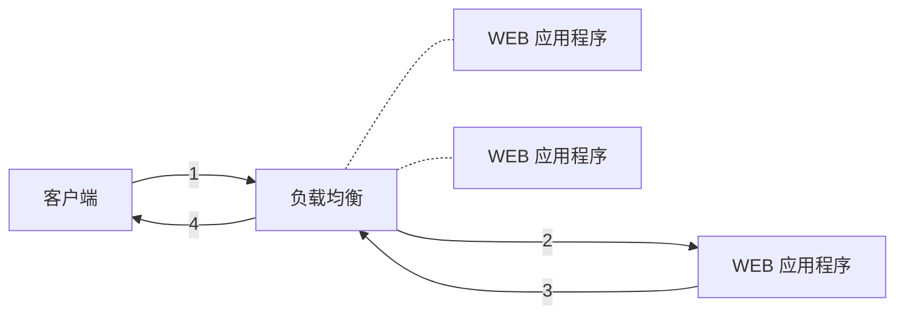
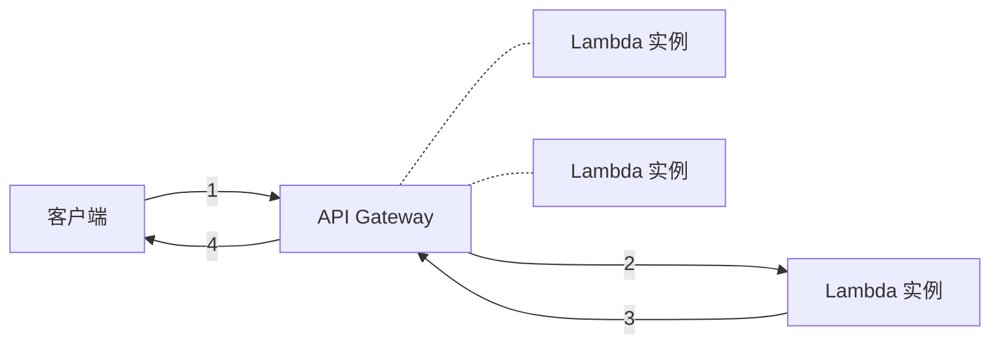

# 【AWS】如何构建无服务器 API

## 故事背景

老板：今天的会议就到这里了，小白，这个 API 你来实现一下吧。上线初期的流量比较低，你选一个既省钱又容易扩容的方案。
小白：好的老板……

 ( 回到工位后…… )

小白：扩容不是大问题，但是还有比只用一台服务器更省钱的方案吗？
大神：比一台服务器更省钱的方案，当然是零台服务器了。
小白：零台服务器？还有这种技术？！
大神：难道你不知道 AWS 的无服务器架构吗？
小白：但求赐教！

 ( 大神开启教学模式 )

## 有服务器架构

传统的有服务器 API 架构是由**负载均衡**和 **WEB 应用程序**所组成的。客户端将请求发送到负载均衡，负载均衡再转发给 WEB 应用程序。WEB 应用程序生成响应结果再通过负载均衡返回给客户端。



## 无服务器架构

无服务器架构和传统的有服务器架构并没有本质的区别，只不过是用 AWS 提供的托管服务作为**负载均衡**和 **WEB 应用程序**。
具体来说是使用托管的 [API Gateway](https://docs.aws.amazon.com/apigateway/latest/developerguide/welcome.html) 作为负载均衡，使用 [Lambda](https://docs.aws.amazon.com/lambda/latest/dg/welcome.html) 作为 WEB 应用程序。

不同之处在于 Lambda 是**按需启动**的。当 API Gateway 接收到请求时会创建 Lambda 实例来处理请求；如果 API Gateway 在一段时间内没有收到请求，那么 Lambda 实例就会被自动释放。释放后停止计费，达到**降低成本**的目的。

扩容也非常简单。当 API Gateway 收到的请求量超出 Lambda 实例的处理能力时，更多的 Lambda 实例就会被自动创建，实现**自动扩容**。



创建一个简单的无服务器 Hello World API 只需 5 步。

### 步骤 1：安装 AWS SAM CLI

AWS Serverless Application Model ( [AWS SAM](https://docs.aws.amazon.com/serverless-application-model/latest/developerguide/what-is-sam.html) ) 是一个开源框架，你可以使用这个框架在 AWS 上构建无服务器应用。
根据你使用的操作系统，依照这篇 [文档](https://docs.aws.amazon.com/zh_cn/serverless-application-model/latest/developerguide/serverless-sam-cli-install.html) 中的步骤安装 AWS SAM CLI。如果你想在本地测试你的 API，你还需要根据文档中的指示安装 Docker。

### 步骤 2：创建示例工程

执行以下命令创建一个示例工程。

```shell
sam init
```

如果你根据提示选择了 Python 项目，你将会看到如下输出。

```shell
-----------------------
Generating application:
-----------------------
Name: sam-app
Runtime: python3.7
Dependency Manager: pip
Application Template: hello-world
Output Directory: .

Next steps can be found in the README file at ./sam-app/README.md
```

至此，一个示例工程就创建完毕了，目录结构如下。

```shell
sam-app/
  ├── README.md
  ├── events/
  │   └── event.json
  ├── hello_world/
  │   ├── __init__.py
  │   ├── app.py            #Contains your AWS Lambda handler logic.
  │   └── requirements.txt  #Contains any Python dependencies the application requires, used for sam build
  ├── template.yaml         #Contains the AWS SAM template defining your application's AWS resources.
  └── tests/
      └── unit/
          ├── __init__.py
          └── test_handler.py
```

有三个文件比较重要：

- template.yaml: 定义 AWS 资源的文件，例如 API Gateway 和 Lambda。
- hello_world/app.py: Lambda 的处理函数。
- hello_world/requirements.txt: 声明 Python 的依赖项。

### 步骤 3：构建你的 API

进入到工程所在目录，然后执行以下命令。

```shell
sam build
```

你会看到如下输出。

```shell
Build Succeeded

Built Artifacts : .aws-sam/build
Built Template : .aws-sam/build/template.yaml

Commands you can use next
=========================
[*] Invoke Function: sam local invoke
[*] Deploy: sam deploy --guided
```

这个命令会把应用程序需要的所有依赖项以及应用程序本身的代码复制到 ```.aws-sam/build``` 目录下。

```shell
.aws-sam/
  └── build/
      ├── HelloWorldFunction/
      └── template.yaml
```

### 步骤 4：部署到 AWS

执行以下命令把程序部署到 AWS 云端。

```shell
sam deploy --guided
```

根据提示输入相应信息，直接输入回车就是遵循默认设置。

> 你可能会被问到 ```HelloWorldFunction may not have authorization defined, Is this okay? [y/N]```，这是 AWS SAM 在告诉你，你的 API 没有身份验证，部署后任何人都可以调用。
> 在这里输入 ```y``` 就可以，我们先不管身份验证的事情。

之后你会得到如下输出。

```shell
Deploying with following values
===============================
Stack name : sam-app
Region : us-east-1
Confirm changeset : False
Deployment s3 bucket : sam-bucket
Capabilities : ["CAPABILITY_IAM"]
Parameter overrides : {}

Initiating deployment
=====================

Waiting for changeset to be created..

CloudFormation stack changeset
---------------------------------------------------------------------------------------------------------------------------------------------------
Operation                                         LogicalResourceId                                 ResourceType
---------------------------------------------------------------------------------------------------------------------------------------------------
+ Add                                             HelloWorldFunctionHelloWorldPermissionProd        AWS:: Lambda:: Permission
+ Add                                             ServerlessRestApiDeployment47fc2d5f9d             AWS:: ApiGateway:: Deployment
+ Add                                             ServerlessRestApiProdStage                        AWS:: ApiGateway:: Stage
+ Add                                             ServerlessRestApi                                 AWS:: ApiGateway:: RestApi
-   Modify                                          HelloWorldFunctionRole                            AWS:: IAM:: Role
-   Modify                                          HelloWorldFunction                                AWS:: Lambda:: Function
---------------------------------------------------------------------------------------------------------------------------------------------------

2019-11-21 14:33:24 - Waiting for stack create/update to complete

CloudFormation events from changeset
-------------------------------------------------------------------------------------------------------------------------------------------------
ResourceStatus                       ResourceType                         LogicalResourceId                    ResourceStatusReason
-------------------------------------------------------------------------------------------------------------------------------------------------
UPDATE_IN_PROGRESS                   AWS:: IAM:: Role                       HelloWorldFunctionRole               -
UPDATE_COMPLETE                      AWS:: IAM:: Role                       HelloWorldFunctionRole               -
UPDATE_IN_PROGRESS                   AWS:: Lambda:: Function                HelloWorldFunction                   -
UPDATE_COMPLETE                      AWS:: Lambda:: Function                HelloWorldFunction                   -
CREATE_IN_PROGRESS                   AWS:: ApiGateway:: RestApi             ServerlessRestApi                    -
CREATE_COMPLETE                      AWS:: ApiGateway:: RestApi             ServerlessRestApi                    -
CREATE_IN_PROGRESS                   AWS:: ApiGateway:: RestApi             ServerlessRestApi                    Resource creation Initiated
CREATE_IN_PROGRESS                   AWS:: ApiGateway:: Deployment          ServerlessRestApiDeployment47fc2d5   Resource creation Initiated
                                                                         f9d
CREATE_IN_PROGRESS                   AWS:: Lambda:: Permission              HelloWorldFunctionHelloWorldPermis   Resource creation Initiated
                                                                         sionProd
CREATE_IN_PROGRESS                   AWS:: Lambda:: Permission              HelloWorldFunctionHelloWorldPermis   -
                                                                         sionProd
CREATE_IN_PROGRESS                   AWS:: ApiGateway:: Deployment          ServerlessRestApiDeployment47fc2d5   -
                                                                         f9d
CREATE_COMPLETE                      AWS:: ApiGateway:: Deployment          ServerlessRestApiDeployment47fc2d5   -
                                                                         f9d
CREATE_IN_PROGRESS                   AWS:: ApiGateway:: Stage               ServerlessRestApiProdStage           -
CREATE_IN_PROGRESS                   AWS:: ApiGateway:: Stage               ServerlessRestApiProdStage           Resource creation Initiated
CREATE_COMPLETE                      AWS:: ApiGateway:: Stage               ServerlessRestApiProdStage           -
CREATE_COMPLETE                      AWS:: Lambda:: Permission              HelloWorldFunctionHelloWorldPermis   -
                                                                         sionProd
UPDATE_COMPLETE_CLEANUP_IN_PROGRES   AWS:: CloudFormation:: Stack           sam-app                              -
S
UPDATE_COMPLETE                      AWS:: CloudFormation:: Stack           sam-app                              -
-------------------------------------------------------------------------------------------------------------------------------------------------

Stack sam-app outputs:
---------------------------------------------------------------------------------------------------------------------------------------------------
OutputKey-Description                                                     OutputValue
---------------------------------------------------------------------------------------------------------------------------------------------------
HelloWorldFunctionIamRole - Implicit IAM Role created for Hello World     arn: aws: iam::123456789012: role/sam-app-
function                                                                  HelloWorldFunctionRole-104VTJ0TST7M0
HelloWorldApi - API Gateway endpoint URL for Prod stage for Hello World   https://0ks2zue0zh.execute-api.us-east-1.amazonaws.com/Prod/hello/
function
HelloWorldFunction - Hello World Lambda Function ARN                      arn: aws: lambda: us-east-1:123456789012: function: sam-app-
                                                                         HelloWorldFunction-1TY92MJX0BXU5
---------------------------------------------------------------------------------------------------------------------------------------------------

Successfully created/updated stack - sam-app in us-east-1
```

至此，你的 API 就被部署到 AWS 云端了。具体来说 ```sam deploy``` 命令创建了一个 [S3](https://docs.aws.amazon.com/AmazonS3/latest/userguide/Welcome.html) bucket，并且把 ```sam build``` 命令产生的文件上传至这个 S3 bucket。最后再用 [Cloud Formation](https://docs.aws.amazon.com/AWSCloudFormation/latest/UserGuide/Welcome.html) 部署应用程序。
```sam deploy``` 会输出 URL 供你测试，你可以用 ```curl``` 工具向 API 发送请求。

```shell
curl https://<restapiid>.execute-api.us-east-1.amazonaws.com/Prod/hello/
```

如果你的 API 部署成功的话，你应该能看到如下响应。

```json
{"message": "hello world"}
```

### 步骤 5： ( 可选 ) 在本地测试你的 API

当你在开发的时候，你通常希望在本地就能测试你的 API。AWS SAM CLI 提供了 ```sam local``` 命令，该命令基于 Docker 来模拟 Lambda 环境。具体来说有两种在本地测试的方式：

- 在本地部署你的 API
- 直接调用 Lambda 函数

下面分别展示这两种方式。

#### 在本地部署 API

```shell
sam local start-api
```

你会得到如下输出。

```shell
2019-07-12 15:27:58 Mounting HelloWorldFunction at http://127.0.0.1:3000/hello [GET]
2019-07-12 15:27:58 You can now browse to the above endpoints to invoke your functions. You do not need to restart/reload SAM CLI while working on your functions, changes will be reflected instantly/automatically. You only need to restart SAM CLI if you update your AWS SAM template
2019-07-12 15:27:58  * Running on http://127.0.0.1:3000/ ( Press CTRL+C to quit )

Fetching lambci/lambda: python3.7 Docker container image......................................................................................................................................................................................
2019-07-12 15:28:56 Mounting /<working-development-path>/sam-app/.aws-sam/build/HelloWorldFunction as /var/task: ro,delegated inside runtime container
START RequestId: 52fdfc07-2182-154f-163f-5f0f9a621d72 Version: $LATEST
END RequestId: 52fdfc07-2182-154f-163f-5f0f9a621d72
REPORT RequestId: 52fdfc07-2182-154f-163f-5f0f9a621d72  Duration: 4.42 ms       Billed Duration: 100 ms Memory Size: 128 MB     Max Memory Used: 22 MB
2019-07-12 15:28:58 No Content-Type given. Defaulting to 'application/json'.
2019-07-12 15:28:58 127.0.0.1 - - [12/Jul/2019 15:28:58] "GET /hello HTTP/1.1" 200 -
```

Docker 会花一点时间加载镜像。加载完毕之后，你就可以用 ```curl``` 向本地部署的 API 发送请求了。

```shell
curl http://127.0.0.1:3000/hello
```

你会得到如下输出。

```shell
2019-07-12 15:29:57 Invoking app.lambda_handler ( python3.7 )
2019-07-12 15:29:57 Found credentials in shared credentials file: ~/.aws/credentials

Fetching lambci/lambda: python3.7 Docker container image......
2019-07-12 15:29:58 Mounting /<working-development-path>/sam-app/.aws-sam/build/HelloWorldFunction as /var/task: ro,delegated inside runtime container
START RequestId: 52fdfc07-2182-154f-163f-5f0f9a621d72 Version: $LATEST
END RequestId: 52fdfc07-2182-154f-163f-5f0f9a621d72
REPORT RequestId: 52fdfc07-2182-154f-163f-5f0f9a621d72  Duration: 7.92 ms       Billed Duration: 100 ms Memory Size: 128 MB     Max Memory Used: 22 MB
{"statusCode":200,"body":"{\"message\": \"hello world\"}"}
```

```start-api``` 这个命令会在本地创建一个 Docker 容器以执行 Lambda 函数，看起来就像在云端执行一样。

#### 直接调用 Lambda 函数

执行以下命令就可以直接调用 Lambda 函数，而不用通过 HTTP 终结点。

```shell
sam local invoke "HelloWorldFunction" -e events/event.json
```

你会得到如下输出。

```shell
2019-07-01 14:08:42 Found credentials in shared credentials file: ~/.aws/credentials
2019-07-01 14:08:42 Invoking app.lambda_handler ( python3.7 )

Fetching lambci/lambda: python3.7 Docker container image...............................................................................................................................................................................................................................................................................................................................................................................................................................................................................................................................................................
2019-07-01 14:09:39 Mounting /<working-development-path>/sam-app/.aws-sam/build/HelloWorldFunction as /var/task: ro,delegated inside runtime container
START RequestId: 52fdfc07-2182-154f-163f-5f0f9a621d72 Version: $LATEST
END RequestId: 52fdfc07-2182-154f-163f-5f0f9a621d72
REPORT RequestId: 52fdfc07-2182-154f-163f-5f0f9a621d72    Duration: 3.51 ms    Billed Duration: 100 ms    Memory Size: 128 MB    Max Memory Used: 22 MB
{"statusCode":200,"body":"{\"message\": \"hello world\"}"}
```

```invoke``` 命令直接调用 Lambda 函数，并且能用你在 ```event.json``` 文件里提供的数据作为输入。

#### 清理资源

由于 AWS SAM 基于 Cloud Formation 创建资源，所以如果你不再需要这篇文章里创建的 API，你可以很容易地清理掉这些资源，以免产生额外费用。

1. 打开 Cloud Formation 的管理页面：<https://console.aws.amazon.com/cloudformation>。
2. 在左侧的面板选择 **Stacks**。
3. 在 Stack 列表里选择 **sam-app** ( 或者你创建工程时自己填的名字 ) 。
4. 选择 Delete。

## 总结

小白：原来使用 AWS SAM 构建无服务器 API 这么简单，可以让老板满意了。
大神：是的，无服务器架构的特点是在资费和性能上均有极大的弹性。当产品初期流量较低时，可以通过减少 Lambda 实例的数量降低成本，甚至在闲时释放所有的实例降到 0 资费。当流量增多时会自动创建更多 Lambda 实例，无需额外工作即可实现扩容。无服务器架构适合产品从 0 到 1，以及从 1 到 100 的整个生命周期。

---
如果想了解无服务器架构的更多信息，请参阅 AWS SAM 的 [官方文档](https://docs.aws.amazon.com/serverless-application-model/latest/developerguide/what-is-sam.html) 。
